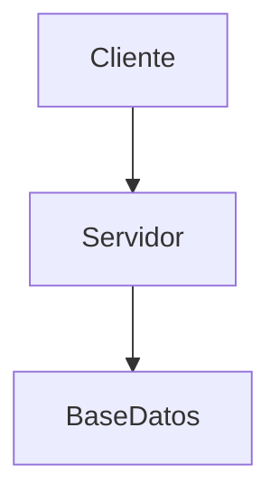

# UD01. Arquitectura web y entorno de desarrollo

## Introducción

En esta unidad conoceremos cómo funciona una aplicación web moderna y prepararemos el entorno de trabajo que utilizaremos durante el curso.

