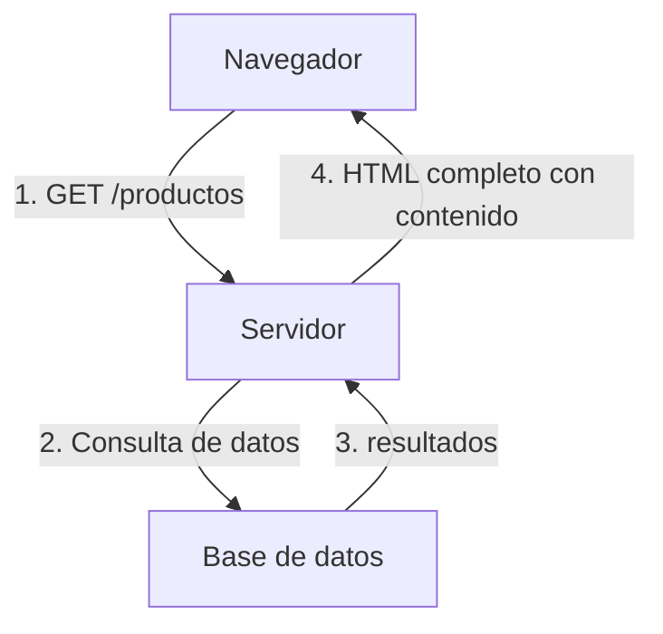
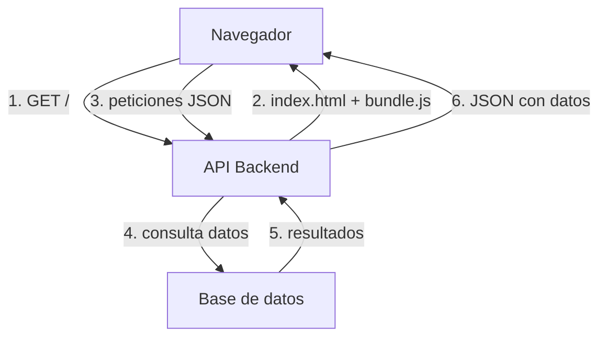
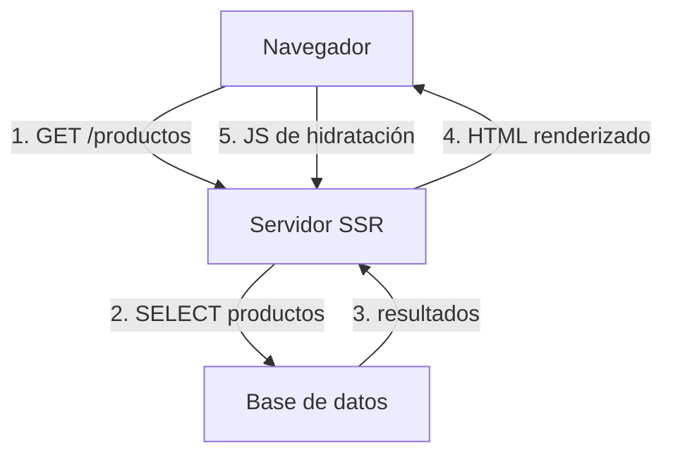
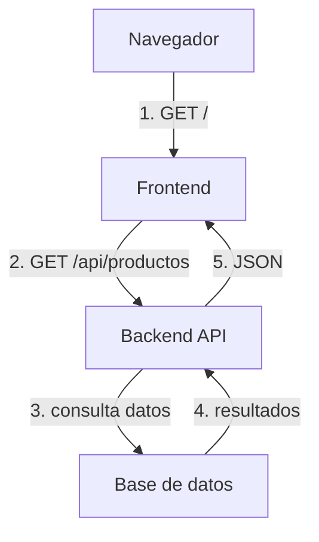

# UD01. Arquitectura web y entorno profesional

## Objetivos

- Comprender los conceptos básicos de la web: navegador, HTML, CSS y JavaScript.
- Conocer qué es un framework y cómo ayuda al desarrollo.
- Identificar las arquitecturas web principales: MPA, SPA, SSR y headless.
- Entender cómo viaja la información en cada modelo.
- Conocer las tecnologías más usadas hoy.

## Contenidos

- Conceptos básicos de frontend y backend.
- Evolución histórica de la web.
- Arquitecturas MPA, SPA, SSR y headless.
- Ejemplos reales de tecnologías y frameworks.
- Comparación de ventajas y limitaciones.

## Relación con los RA

- RA1: análisis de arquitecturas y tecnologías.
- RA8: generación dinámica de páginas web.

---

## Conceptos básicos

### Navegador

El navegador es la aplicación que usamos para ver páginas web. Interpreta el código que envía el servidor y muestra la página al usuario.

- Ejemplos:  Chrome,  Firefox,  Edge,  Safari.

El navegador trabaja con tres lenguajes principales: HTML, CSS y JavaScript.

### Cliente y servidor

En web siempre hay dos partes:

- **Cliente**: el navegador, que pide información.
- **Servidor**: la aplicación o servicio que responde a esas peticiones.

Una petición se hace a través de **HTTP** usando una **URL**. El servidor procesa la petición y envía una respuesta.

### HTML

HTML (HyperText Markup Language) describe la estructura del contenido.

```html
<h1>DWES</h1>
<p>Bienvenidos al módulo de Desarrollo Web en Entorno Servidor.</p>
```

### CSS

CSS (Cascading Style Sheets) define los estilos visuales: colores, fuentes, márgenes y disposición.

```css
h1 {
  color: #1a73e8;
  font-family: Arial, sans-serif;
}
```

### JavaScript

JavaScript añade comportamiento. Permite responder a eventos, modificar la página y pedir datos al servidor.

```js
document.querySelector('button').addEventListener('click', () => {
  alert('¡Hola!');
});
```

### DOM y JSON

- El **DOM** (Document Object Model) es la representación de la página en el navegador.
- **JSON** (JavaScript Object Notation) es un formato de datos usado para intercambiar información entre cliente y servidor.

Ejemplo de JSON:

```json
{
  "nombre": "Producto",
  "precio": 19.99
}
```

### ¿Qué es un framework?

Un framework es un conjunto de herramientas y normas que facilita el desarrollo.

- En frontend ayuda a construir interfaces y organizar componentes.
- En backend ayuda a gestionar peticiones, rutas y respuestas.

Ejemplos de tecnologías:

| Tecnología | Tipo | Lenguaje / Plataforma |
|---|---|---|
|  React | Framework frontend | JavaScript |
|  Vue | Framework frontend | JavaScript |
|  Angular | Framework frontend | TypeScript / JavaScript |
|  Svelte | Framework frontend | JavaScript |
|  Express | Framework backend | JavaScript (Node.js) |
|  Django | Framework backend | Python |

### Historia breve de los conceptos

- En los años 90 las páginas eran estáticas y el navegador solo mostraba contenido.
- En 1995 se añadió JavaScript para hacer la página interactiva en el cliente.
- En la década de 2000 se estrenaron lenguajes como PHP, Java/JSP y ASP.NET para generar páginas dinámicas en el servidor.
- Con frameworks modernos se unieron los dos mundos: cliente y servidor colaboran y cada uno puede compartir trabajo.

---

## 1. Breve historia de la web

| Año | Tecnología | Importancia |
|---|---|---|
| 1991 | HTML | Páginas estáticas |
| 1995 | JavaScript | Interactividad en el navegador |
| 1996 | CSS | Estilos y diseño |
| 1995 | PHP | Código en el servidor |
| 2005 | Ruby on Rails | MVC en servidor |
| 2010 | AngularJS | Nace el concepto SPA |
| 2013 | React | Componentes declarativos |
| 2014 | Vue | Reactividad sencilla |
| 2016 | Node.js / Express | JavaScript en servidor |
| 2020 | Next.js / Nuxt / Remix | SSR e híbrido moderno |

Esta evolución muestra cómo la web ha pasado de páginas estáticas a aplicaciones complejas.

---

## 2. Arquitectura MPA (Multi-Page Application)

### 2.1 ¿Qué es?

Una MPA es una aplicación en la que cada cambio de página provoca una nueva petición al servidor.

- El servidor envía HTML completo.
- El navegador recarga la página.
- La navegación se realiza con enlaces normales.

### 2.2 Cómo viaja la información



En esta arquitectura:

1. El navegador pide una URL al servidor.
2. El servidor consulta la base de datos.
3. La base de datos devuelve los datos.
4. El servidor construye una página HTML completa y la envía.

El navegador recibe la página ya lista para mostrar al usuario. Cada nuevo enlace recarga la página entera.

### 2.3 Ejemplo de tecnologías

| Tecnología | Tipo | Lenguaje |
|---|---|---|
|  PHP | Lenguaje de servidor | PHP |
|  JSP / Servlets | Plataforma / API de servidor | Java |
|  ASP.NET MVC | Framework backend | C# / .NET |
|  Django | Framework backend | Python |
|  Ruby on Rails | Framework backend | Ruby |
|  Node.js +  Express | Plataforma + framework backend | JavaScript |

### 2.4 Código de ejemplo

Servidor Express:

```js
app.get('/productos', async (req, res) => {
  const productos = await db.query('SELECT * FROM productos');
  res.render('productos', { productos });
});
```

Plantilla EJS:

```html
<ul>
  <% productos.forEach(p => { %>
    <li><%= p.nombre %> - <%= p.precio %> €</li>
  <% }); %>
</ul>
```

### 2.5 Ventajas y desventajas

- Ventajas:
  - SEO sencillo.
  - Menos JavaScript necesario.
  - Fácil de comprender.
- Desventajas:
  - Cambios de página recargan todo.
  - Menos interactividad.
  - Puede ser más lento en apps complejas.

---

## 3. Arquitectura SPA (Single Page Application)

### 3.1 ¿Qué es?

Una SPA carga una sola página HTML, y el navegador actualiza la interfaz sin recargar.

- Se descarga `index.html` y JavaScript.
- La navegación interna usa el cliente.
- El servidor ofrece datos en JSON.

### 3.2 Cómo viaja la información



En este modelo:

1. El navegador carga la aplicación inicial (`index.html`).
2. El servidor envía el HTML base y el código JavaScript.
3. El navegador pide datos a la API cuando los necesita.
4. El backend consulta la base de datos y devuelve JSON.
5. El navegador usa esos datos para actualizar la interfaz sin recargar.

### 3.3 Ejemplo de tecnologías

| Tecnología | Tipo | Lenguaje |
|---|---|---|
|  React | Biblioteca / framework frontend | JavaScript |
|  Vue | Framework frontend | JavaScript |
|  Angular | Framework frontend | TypeScript / JavaScript |
|  Svelte | Framework frontend | JavaScript |

### 3.4 Código de ejemplo

Componente React:

```js
useEffect(() => {
  fetch('/api/productos')
    .then(res => res.json())
    .then(data => setProductos(data));
}, []);
```

API en Express:

```js
app.get('/api/productos', async (req, res) => {
  const productos = await db.query('SELECT * FROM productos');
  res.json(productos);
});
```

### 3.5 Ventajas y desventajas

- Ventajas:
  - Navegación muy fluida.
  - Buena experiencia tipo aplicación.
  - Backend reutilizable.
- Desventajas:
  - Carga inicial mayor.
  - SEO requiere cuidados.
  - Depende mucho de JavaScript.

---

## 4. SSR (Server Side Rendering)

### 4.1 ¿Qué es?

SSR genera HTML desde el servidor para cada petición, pero mantiene interactividad en el cliente.

- El servidor construye la página con datos.
- El navegador recibe HTML listo.
- El cliente puede hidratar la página.

### 4.2 Cómo viaja la información



### 4.3 Ejemplo de tecnologías

| Tecnología | Tipo | Lenguaje |
|---|---|---|
|  Next.js | Framework SSR / híbrido | JavaScript |
|  Nuxt | Framework SSR / híbrido | JavaScript |
|  Remix | Framework SSR / híbrido | JavaScript |
|  SvelteKit | Framework SSR / híbrido | JavaScript |
|  Astro | Framework / generador de sitios | JavaScript |

### 4.4 Código de ejemplo

Next.js:

```js
export async function getServerSideProps() {
  const productos = await fetch('https://miapi.local/api/productos').then(r => r.json());
  return { props: { productos } };
}

export default function ProductosPage({ productos }) {
  return (
    <ul>
      {productos.map(p => <li key={p.id}>{p.nombre}</li>)}
    </ul>
  );
}
```

### 4.5 Ventajas y desventajas

- Ventajas:
  - Carga inicial rápida.
  - Mejor SEO.
  - Bueno para contenido dinámico.
- Desventajas:
  - Más complejo.
  - El servidor necesita más recursos.
  - La hidratación añade pasos extra.

---

## 5. Headless y arquitecturas híbridas

### 5.1 ¿Qué es headless?

Headless separa backend y frontend. El backend solo ofrece datos en APIs, el frontend se encarga de la interfaz.

### 5.2 Cómo viaja la información



En una arquitectura headless:

1. El navegador recibe la aplicación frontend.
2. El frontend pide datos a una API.
3. La API consulta la base de datos.
4. La API devuelve JSON.
5. El frontend muestra los datos sin generar HTML en el backend.

### 5.3 Ejemplo de tecnologías

| Tecnología | Tipo | Lenguaje |
|---|---|---|
|  React +  Express API | Frontend + Backend | JavaScript |
|  Next.js + API routes | Framework híbrido | JavaScript |
|  Gatsby + GraphQL | Framework frontend + API | JavaScript |
|  Strapi /  Sanity /  Contentful | Headless CMS / API | JavaScript / SaaS |

### 5.4 Ventajas y desventajas

- Ventajas:
  - Separación total.
  - Backend reutilizable.
  - Buena para varios clientes.
- Desventajas:
  - Más complejo.
  - Requiere coordinación.
  - Despliegue más sofisticado.

---

## 6. Comparación de arquitecturas

| Arquitectura | Qué envía el servidor | Qué hace el cliente | Mejor uso |
|---|---|---|---|
| MPA | HTML completo | Pinta la página | Sitios informativos y formularios simples |
| SPA | HTML inicial + JS | Actualiza vistas | Aplicaciones interactivas |
| SSR | HTML inicial renderizado | Hidrata e interactúa | Contenido dinámico con SEO |
| Headless | JSON / API | Renderiza frontend | Múltiples clientes |

---

## 7. Tecnologías actuales

### 7.1 Frontend

| Tecnología | Tipo | Lenguaje |
|---|---|---|
|  React | Biblioteca / framework frontend | JavaScript |
|  Vue | Framework frontend | JavaScript |
|  Angular | Framework frontend | TypeScript / JavaScript |
|  Svelte | Framework frontend | JavaScript |
|  Ember | Framework frontend | JavaScript |
|  Backbone | Framework frontend | JavaScript |

### 7.2 SSR / Híbrido

| Tecnología | Tipo | Lenguaje |
|---|---|---|
|  Next.js | Framework SSR / híbrido | JavaScript |
|  Nuxt | Framework SSR / híbrido | JavaScript |
|  Remix | Framework SSR / híbrido | JavaScript |
|  SvelteKit | Framework SSR / híbrido | JavaScript |
|  Astro | Framework / generador de sitios | JavaScript |
|  Gatsby | Framework estático / híbrido | JavaScript |

### 7.3 Backend

| Tecnología | Tipo | Lenguaje |
|---|---|---|
|  Express | Framework backend | JavaScript |
|  NestJS | Framework backend | TypeScript |
|  Fastify | Framework backend | JavaScript |
|  Django | Framework backend | Python |
|  Laravel | Framework backend | PHP |
|  Ruby on Rails | Framework backend | Ruby |

---

## 8. Datos de uso y mercado

- React es una de las librerías más utilizadas. Fuente: [Stack Overflow Developer Survey 2024](https://survey.stackoverflow.co/2024/).
- Node.js es una de las plataformas más usadas para backend. Fuente: [State of JS 2024](https://stateofjs.com/).
- Next.js está ganando popularidad para proyectos con SSR. Fuente: [GitHub Octoverse](https://octoverse.github.com/).

---

## 9. Enlaces útiles

- [Stack Overflow Developer Survey 2024](https://survey.stackoverflow.co/2024/)
- [State of JS 2024](https://stateofjs.com/)
- [GitHub Octoverse](https://octoverse.github.com/)

---

## 10. Qué veremos en el módulo

En este módulo estudiaremos:

- Node.js + Express para backend.
- Plantillas para renderizar HTML en servidor.
- APIs REST para enviar datos JSON.
- React como ejemplo de frontend.
- Bases de datos para almacenar información.

---

## 11. Resumen final

- **MPA**: servidor envía páginas completas.
- **SPA**: cliente actualiza la interfaz.
- **SSR**: servidor envía HTML inicial renderizado.
- **Headless**: el backend ofrece datos y el frontend muestra la interfaz.

En la siguiente unidad veremos ejemplos prácticos de estas arquitecturas.

- React es una de las librerías más utilizadas. Fuente: [Stack Overflow Developer Survey 2024](https://survey.stackoverflow.co/2024/).
- Node.js es una de las plataformas más usadas para backend. Fuente: [State of JS 2024](https://stateofjs.com/).
- Next.js está ganando popularidad para proyectos con SSR.

---
