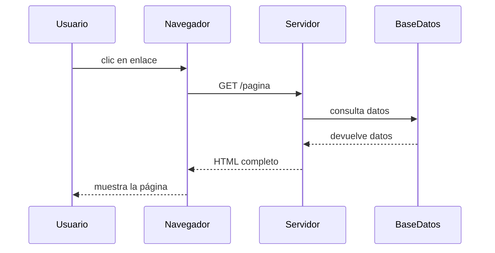
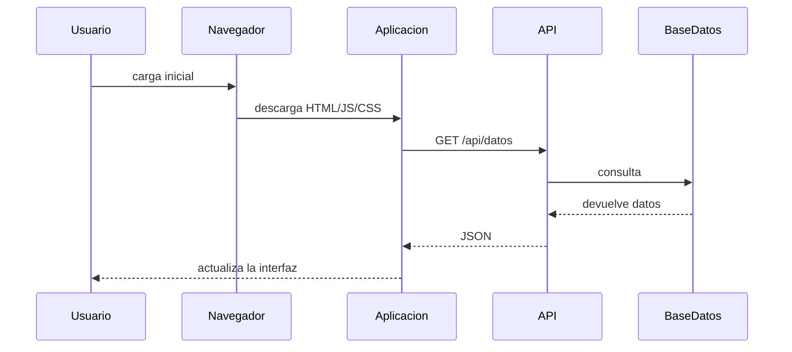
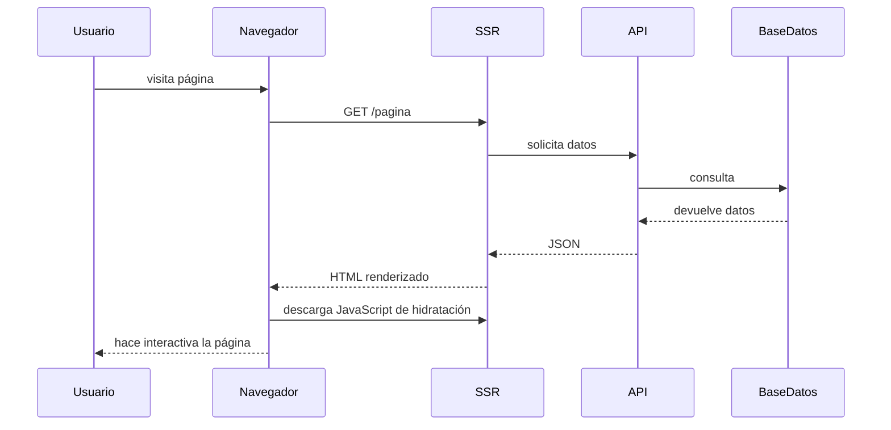
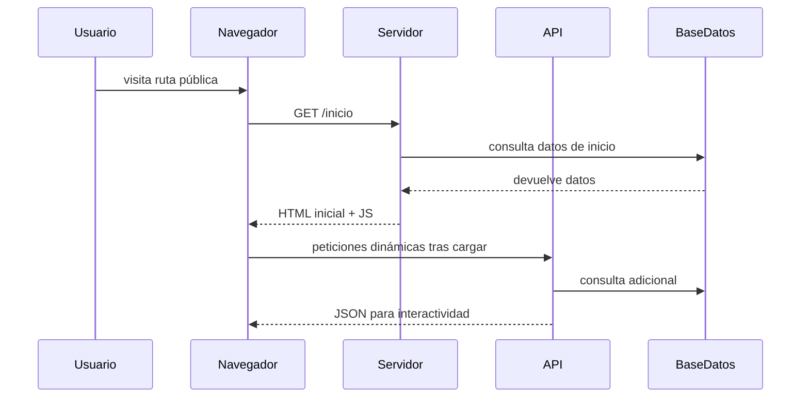
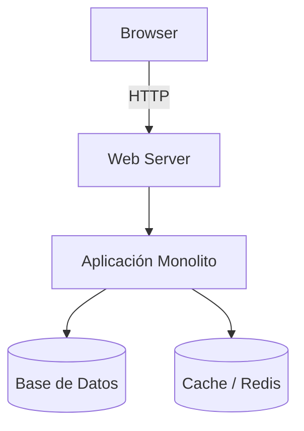
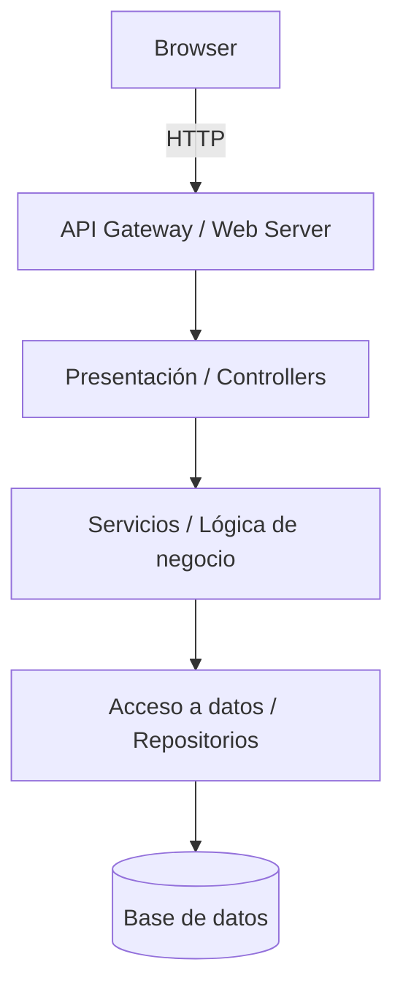
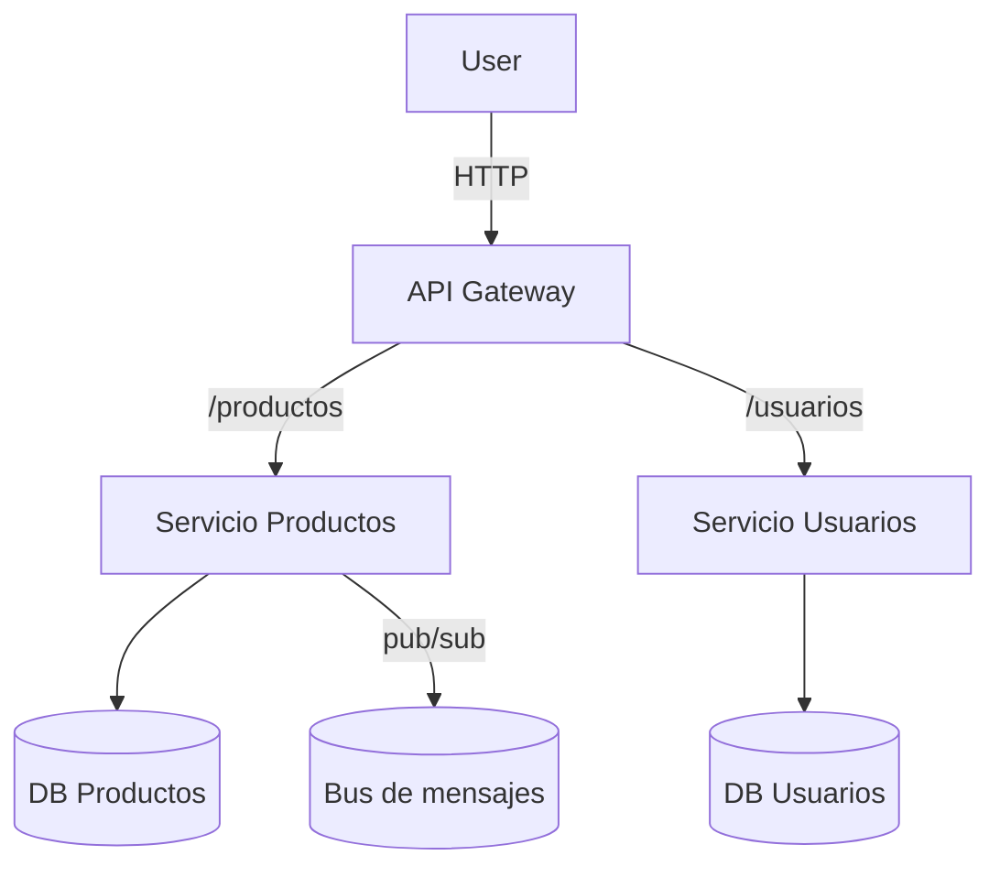
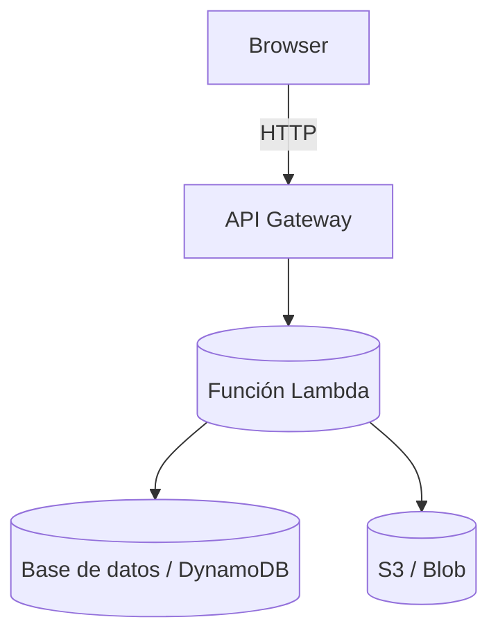

# Propuesta ampliada de arquitectura web para UD01

Esta propuesta explica los conceptos fundamentales, los modelos de renderizado y las arquitecturas backend que los alumnos deben conocer para desarrollar aplicaciones web modernas.

---

## 1. Fundamentos de la arquitectura web

Este primer bloque define términos que se usan a lo largo de todo el contenido. El objetivo es que el alumno comprenda el papel de cada elemento antes de ver los modelos y las arquitecturas concretas.

### 1.1 Cliente y servidor

Una aplicación web se basa en una comunicación entre dos actores principales:

- **Cliente**: habitualmente un navegador como  Chrome,  Firefox o  Edge.
- **Servidor**: un servicio que recibe peticiones, procesa datos y devuelve respuestas.

El cliente y el servidor se comunican usando el protocolo **HTTP** o su versión segura **HTTPS**. Cada mensaje se envía a través de una **URL** y un método como `GET`, `POST`, `PUT` o `DELETE`.

### 1.2 HTML

**HTML** (HyperText Markup Language) define la estructura del contenido que el navegador muestra. Una página HTML contiene etiquetas como `h1`, `p`, `ul`, `table` y `form` para organizar información.

Ejemplo simple de HTML:

```html
<h1>DWES</h1>
<p>Aplicación web basada en arquitecturas modernas.</p>
```

### 1.3 CSS

**CSS** (Cascading Style Sheets) describe el aspecto visual. CSS controla colores, fuentes, márgenes, distribución en columnas y la adaptación a pantallas móviles.

Ejemplo básico de CSS:

```css
body {
  font-family: Arial, sans-serif;
  background: #f7f7f7;
}
```

### 1.4 JavaScript

**JavaScript** añade comportamiento a la página. Permite escuchar eventos, modificar el contenido en el navegador y realizar peticiones a APIs.

Ejemplo de JavaScript en el cliente:

```js
document.querySelector("button").addEventListener("click", () => {
  console.log("Botón pulsado");
});
```

### 1.5 DOM

El **DOM** (Document Object Model) es la representación en memoria del documento HTML. JavaScript puede leer y modificar el DOM para cambiar la página sin recargarla completamente.

### 1.6 JSON

**JSON** (JavaScript Object Notation) es un formato de datos ligero y legible. Se usa habitualmente para enviar información entre cliente y servidor.

Ejemplo de JSON:

```json
{
  "producto": "Camiseta",
  "precio": 19.99,
  "disponible": true
}
```

### 1.7 API y REST

Una **API** define cómo pedir y recibir datos. En el desarrollo web, una **API REST** utiliza URLs y métodos HTTP para representar recursos y operaciones.

Los métodos más habituales son:

- `GET`: obtener datos.
- `POST`: crear un nuevo recurso.
- `PUT` / `PATCH`: actualizar datos existentes.
- `DELETE`: borrar un recurso.

Una API REST bien diseñada separa el contrato de datos (JSON) de la implementación interna del servidor.

### 1.8 Frameworks y librerías

Un **framework** es un conjunto de herramientas que define una forma concreta de construir aplicaciones. Una **librería** es un conjunto de funciones reutilizables que el desarrollador usa donde las necesite.

Ejemplos:  React,  Vue,  Django 
y  Next.js. Un framework establece patrones de trabajo y una arquitectura inicial.

### 1.9 SEO

**SEO** (Search Engine Optimization) es la práctica de hacer que el contenido sea más fácil de encontrar en buscadores. En web se logra con HTML correcto, metadatos, velocidad de carga y contenido indexable.

Un modelo con buen SEO entrega HTML legible para los robots de búsqueda desde la primera carga.

### 1.10 Caché y cookies

La **caché** almacena recursos para que el navegador o un servidor intermedio no tengan que descargarlos de nuevo cada vez. Una caché bien configurada mejora el rendimiento.

Las **cookies** son pequeños datos que el servidor guarda en el navegador. Permiten mantener sesiones, recordar preferencias y gestionar autenticación.

### 1.11 CDN y HTTPS

Un **CDN** (Content Delivery Network) distribuye recursos estáticos como imágenes y scripts desde nodos cercanos al usuario. Esto reduce la latencia y mejora la velocidad global.

**HTTPS** cifra la información entre cliente y servidor. En aplicaciones modernas es obligatorio, porque protege datos de usuarios y mejora la confianza de buscadores.

---

## 2. Historia y evolución de la web

Para comprender los modelos de renderizado es útil seguir una línea temporal de hitos históricos. Cada modelo se desarrolló para resolver problemas técnicos y de experiencia de usuario.

### 2.1 Hitos clave

- 1991: se publica HTML y las primeras páginas son estáticas.
- 1995: aparece JavaScript y el navegador empieza a soportar interactividad.
- 1995-2000: los servidores usan PHP, JSP y ASP para generar HTML dinámico.
- 2000: AJAX introduce llamadas asíncronas sin recargar la página.
- 2010: nacen las primeras SPA como AngularJS y las aplicaciones de una sola página.
- 2013: React populariza componentes declarativos en el cliente.
- 2015: aparece el interés por SSR para mejorar SEO y rendimiento inicial.
- 2020: el enfoque headless se consolida para separar frontend y backend.

---

## 3. Modelos de renderizado

Cada modelo describe dónde se genera el HTML y cómo se actualiza la interfaz en el cliente. La elección influye en SEO, rendimiento, experiencia y complejidad de desarrollo.

### 3.1 MPA (Multi-Page Application)

En una MPA, cada vez que el usuario navega a una nueva página, el navegador solicita una URL distinta y recibe HTML completo del servidor.

Este modelo se asocia con los primeros sitios web de los años 90 y los sistemas de gestión de contenidos que siguen construyendo páginas en servidor.



#### Características de MPA

- El servidor controla el renderizado de la página.
- El cliente recibe HTML listo para mostrar.
- La navegación recarga el documento entero.
- Es adecuado para sitios con contenido estático o formularios tradicionales.

#### Ejemplos de tecnologías

Un sitio MPA puede construirse con frameworks como  Laravel,  Django o  ASP.NET MVC.

#### Ejemplo de código — MPA (Express + EJS)

```js
// server.js
const express = require('express');
const app = express();
app.set('view engine', 'ejs');

app.get('/productos', async (req, res) => {
  const productos = await db.query('SELECT * FROM productos');
  res.render('productos', { productos });
});

app.listen(3000);
```

Plantilla `productos.ejs`:

```html
<ul>
  <% productos.forEach(p => { %>
    <li><%= p.nombre %> - <%= p.precio %> €</li>
  <% }); %>
</ul>
```

### 3.2 SPA (Single Page Application)

El modelo SPA surgió con aplicaciones que querían comportarse como software de escritorio. El navegador carga una sola página inicial y el resto de la navegación se realiza en el cliente.

Esta idea ganó impulso con librerías como  AngularJS y más tarde con  React.



#### Características de SPA

- El cliente gestiona el enrutado y la actualización de vistas.
- El servidor actúa principalmente como proveedor de datos.
- La primera carga puede ser más pesada, pero la navegación posterior es muy fluida.
- Es adecuado para aplicaciones con muchas interacciones y estados en el cliente.

#### Ejemplos de tecnologías


Las SPAs se desarrollan con  Vue,  React o  Svelte.

#### Ejemplo de código — SPA (React)

```js
// ProductosList.jsx
import { useEffect, useState } from 'react';

export default function ProductosList() {
  const [productos, setProductos] = useState([]);

  useEffect(() => {
    fetch('/api/productos')
      .then(r => r.json())
      .then(setProductos);
  }, []);

  return (
    <ul>
      {productos.map(p => <li key={p.id}>{p.nombre} — {p.precio} €</li>)}
    </ul>
  );
}
```

API en Express (ejemplo):

```js
app.get('/api/productos', async (req, res) => {
  const productos = await db.query('SELECT * FROM productos');
  res.json(productos);
});
```

### 3.3 SSR (Server Side Rendering)

El SSR reapareció cuando los proyectos empezaron a necesitar SEO sin renunciar a la interactividad del cliente. Con SSR, el servidor genera HTML inicial y el navegador lo hidrata con JavaScript.



#### Características de SSR

- El servidor devuelve HTML listo para mostrar en la primera carga.
- El cliente puede ejecutar JavaScript sobre ese HTML para que la página sea interactiva.
- Mejora el SEO y el tiempo hasta el primer render.
- Es útil para páginas con contenido dinámico y público.

#### Ejemplos de tecnologías


Se usa con frameworks como  Next.js,  Nuxt y  Remix.

#### Ejemplo de código — SSR (Next.js)

```js
export async function getServerSideProps() {
  const productos = await fetch('https://miapi.local/api/productos').then(r => r.json());
  return { props: { productos } };
}

export default function ProductosPage({ productos }) {
  return (
    <ul>
      {productos.map(p => <li key={p.id}>{p.nombre}</li>)}
    </ul>
  );
}
```

### 3.4 Modelo híbrido

El modelo híbrido combina SSR para las páginas que necesitan SEO con una experiencia SPA en las interacciones posteriores. Muchas aplicaciones modernas usan este enfoque para aprovechar lo mejor de ambos mundos.




#### Características del modelo híbrido

- Combina el SEO de SSR con la fluidez de una SPA.
- Permite renderizar páginas públicas y ofrecer experiencia rica en el mismo proyecto.
- Requiere un diseño claro para decidir qué se renderiza en servidor y qué en cliente.

#### Ejemplo de código — Híbrido (HTML inicial + hidratación ligera)

Servidor que envía HTML inicial y pequeño script de hidratación:

```html
<!-- server-rendered index.html -->
<div id="app"> <!-- contenido inicial ya renderizado --> </div>
<script src="/static/app.bundle.js"></script>
```

En `app.bundle.js` se puede ejecutar una hidratación mínima:

```js
import { initApp } from './app';
initApp(document.getElementById('app'));
```

### 3.5 Headless y API-first

El enfoque **headless** separa completamente el backend del frontend. El backend expone APIs y el frontend consume datos para generar la interfaz. Esto es útil cuando una misma lógica debe servir a una web, una app móvil y otros clientes.


#### Características del headless

- El backend es una API independiente.
- El frontend puede ser una SPA, una aplicación móvil o un sitio estático.
- Permite reutilizar la lógica de negocio en varios canales.

#### Ejemplo de código — Headless (API + frontend separado)

API en Express:

```js
app.get('/api/productos', async (req, res) => {
  const productos = await db.query('SELECT * FROM productos');
  res.json(productos);
});
```

Frontend estático (fetch desde cualquier cliente):

```js
fetch('https://api.midominio.com/productos')
  .then(r => r.json())
  .then(data => renderProductos(data));
```

API en Express:

```js
app.get('/api/productos', async (req, res) => {
  const productos = await db.query('SELECT * FROM productos');
  res.json(productos);
});
```

Frontend estático (fetch desde cualquier cliente):

```js
fetch('https://api.midominio.com/productos')
  .then(r => r.json())
  .then(data => renderProductos(data));
```


## 4. Arquitecturas backend

El estilo de arquitectura backend describe cómo se organiza el código y los servicios dentro del servidor. Estas decisiones afectan la escalabilidad, el despliegue y el mantenimiento.

### 4.1 Monolito

En un monolito, toda la aplicación backend se despliega como una sola unidad. Esto facilita el inicio del proyecto y reduce la complejidad operativa al principio.

Muchas aplicaciones tradicionales construidas con  Laravel o  Django son monolíticas.

#### Diagrama — Monolito



#### Ejemplo de código — Monolito (Express)

```js
// app.js (monolito)
const express = require('express');
const app = express();

app.get('/productos', async (req, res) => {
  const productos = await db.query('SELECT * FROM productos');
  res.render('productos', { productos });
});

app.get('/admin/usuarios', async (req, res) => {
  // lógica de administración en la misma app
});

app.listen(3000);
```

### 4.2 N-capas

La arquitectura de tres capas separa la presentación, la lógica de negocio y la persistencia de datos. Esta separación hace que el código sea más mantenible y escalable que un monolito simple.

Un esquema típico es:

- Capa de presentación: frontend o API Gateway.
- Capa de negocio: servicios y reglas de aplicación.
- Capa de datos: base de datos y acceso a datos.

#### Diagrama — N-capas (3 capas)



#### Ejemplo de código — N-capas (esquema)

// Estructura de ficheros (ejemplo)
```
src/controllers/productosController.js    // recibe petición, valida y llama servicio
src/services/productosService.js          // lógica de negocio
src/repositories/productosRepository.js   // consultas a la base de datos
```

Pequeño ejemplo en `productosController.js`:

```js
import { listarProductos } from '../services/productosService.js';

export async function getProductos(req, res) {
  const productos = await listarProductos();
  res.json(productos);
}
```

Y en `productosService.js`:

```js
import { fetchAll } from '../repositories/productosRepository.js';

export function listarProductos() {
  return fetchAll();
}
```


### 4.3 Microservicios

Un sistema de microservicios divide la aplicación en servicios pequeños e independientes, cada uno responsable de una función concreta. Cada servicio puede desplegarse, escalarse y actualizarse por separado.

Se apoya en contenedores como  Docker y orquestadores como  Kubernetes.

#### Diagrama — Microservicios



#### Ejemplo de código — Microservicio (Express)

```js
// microservice-productos/index.js
const express = require('express');
const app = express();

app.get('/productos', async (req, res) => {
  const productos = await db.query('SELECT * FROM productos');
  res.json(productos);
});

app.listen(3001);
```

Dockerfile mínimo:

```dockerfile
FROM node:18
WORKDIR /app
COPY package*.json ./
RUN npm install --production
COPY . .
CMD ["node", "index.js"]
```

### 4.4 Serverless

La arquitectura serverless ejecuta funciones bajo demanda en la nube. El desarrollador no gestiona servidores, y paga solo por el tiempo de ejecución real.

Ejemplos de plataformas serverless incluyen  AWS Lambda y  Azure Functions.

#### Diagrama — Serverless



#### Ejemplo de código — Serverless (AWS Lambda)

```js
// handler.js
exports.handler = async (event) => {
  // event contiene información de la petición
  const productos = await queryProductos();
  return {
    statusCode: 200,
    headers: { 'Content-Type': 'application/json' },
    body: JSON.stringify(productos),
  };
};
```


---

## 5. Comparación de modelos y arquitecturas

Esta comparación ayuda a elegir una solución en función de los requisitos del proyecto. No existe una única respuesta correcta; la decisión depende de los objetivos concretos.

| Modelo / Arquitectura | Rendimiento inicial | SEO | Interactividad | Complejidad | Uso típico |
|---|---|---|---|---|---|
| MPA | Alto | Muy bueno | Bajo | Bajo | Sitios informativos y formularios |
| SPA | Medio | Medio | Muy alto | Alto | Aplicaciones internas y paneles |
| SSR | Muy alto | Muy bueno | Alto | Medio | Comercio electrónico y contenidos dinámicos |
| Híbrido | Muy alto | Muy bueno | Muy alto | Alto | Productos mixtos y marketing + app |
| Headless | Medio | Depende del frontend | Alto | Alto | Plataformas multi-canal |
| Monolito | Medio | Depende del renderizado | Medio | Bajo | MVPs y proyectos pequeños |
| N-capas | Medio | Depende del renderizado | Medio | Medio | Aplicaciones empresariales |
| Microservicios | Variable | Depende del renderizado | Variable | Muy alto | Sistemas grandes y distribuidos |
| Serverless | Variable | Depende del renderizado | Variable | Alto | Procesos event-driven y picos de carga |

---

## 6. Diseño de una aplicación real

Al diseñar una aplicación, hay que responder a preguntas concretas:

- ¿Necesita el contenido ser indexado por buscadores?
- ¿La experiencia debe sentirse como una aplicación nativa?
- ¿Cuánto control se necesita sobre el renderizado inicial?
- ¿Existe un backend que deba servir varios clientes?
- ¿El equipo prefiere trabajar en frontend, backend o ambos?

Una buena propuesta de arquitectura se basa en estos criterios y en la naturaleza de los datos, las interacciones y el público objetivo.

### 6.1 Elegir entre MPA y SPA

Si el sitio es informativo y el contenido es estático, una MPA es una opción adecuada. Si la aplicación gestiona muchos estados, filtros y actualizaciones de pantalla, entonces una SPA es más natural.

### 6.2 Elegir SSR o híbrido

Cuando el SEO importa y también se desea una experiencia app, el SSR o el modelo híbrido son las mejores opciones. El SSR es especialmente útil en páginas públicas que deben cargarse rápido y ser indexadas correctamente.

### 6.3 Elegir arquitecturas backend

Un monolito puede ser suficiente en una fase inicial, pero una arquitectura n-capas facilita el crecimiento. Los microservicios se reservan para proyectos con múltiples dominios funcionales y equipos independientes. Serverless es útil para tareas concretas o cargas variables.

---

## 7. Tecnologías en el contexto de DWES

En DWES se estudian tecnologías que cubren el backend, el frontend y las APIs. A continuación se muestran tablas con los logos validados (mismo conjunto fiable que en el índice) organizadas por área.

| Frontend | SSR / Híbrido | Backend |
|---|---|---|
|  React<br> Vue |  Next.js<br> Nuxt |  Node.js<br> Express |
|  Angular<br> Svelte |  Remix<br> SvelteKit |  Django<br> Laravel |

Estas tablas usan los iconos validados en el índice y proporcionan una referencia visual consistente para los alumnos.

### 7.1 Backend y API

En el backend se define la estructura de datos, las rutas y las reglas de negocio. Para una API REST se crean endpoints que devuelven JSON y aceptan datos desde el cliente.

Ejemplo de ruta en backend:

```js
app.get("/api/productos", async (req, res) => {
  const productos = await db.query("SELECT * FROM productos");
  res.json(productos);
});
```

### 7.2 Frontend y datos

El frontend consulta la API, recibe JSON y muestra los datos en la interfaz. Un componente puede solicitar la información y construir la vista con HTML y CSS en el navegador.

### 7.3 SEO y renderizado

Para que una página se indexe bien, conviene que el servidor entregue HTML con contenido relevante desde la primera petición. Los modelos SSR y MPA son los más adecuados para este objetivo.

---

## 8. Valores y criterios de diseño

Los criterios más importantes al elegir una arquitectura son:

- **Rendimiento**: tiempo de carga, tamaño de recursos y uso de caché.
- **SEO**: capacidad de indexación y metadatos adecuados.
- **Mantenibilidad**: claridad del código y separación de responsabilidades.
- **Escalabilidad**: posibilidad de crecer en usuarios o servicios.
- **Seguridad**: protección de datos y control de acceso.
- **Experiencia de usuario**: fluidez, accesibilidad y navegación intuitiva.

Un diseño equilibrado busca un buen rendimiento sin sacrificar la calidad de la experiencia y la seguridad.

### 8.1 Caché y experiencia

El uso inteligente de caché reduce el tiempo de carga y el número de peticiones al servidor. Un navegador puede almacenar recursos estáticos, y un CDN puede servirlos desde un nodo cercano al usuario.

### 8.2 Cookies y sesiones

Las cookies permiten conservar datos de sesión y preferencias en el navegador. El servidor usa esas cookies para identificar al usuario y mantener el estado de su sesión.

### 8.3 Seguridad y HTTPS

HTTPS protege los datos en tránsito. Un sitio moderno siempre debe usar HTTPS y políticas de seguridad como Content Security Policy para reducir riesgos.

---

## 9. Aplicaciones prácticas y casos reales

### 9.1 Comercio electrónico

Un sitio de comercio electrónico suele requerir SEO para las fichas de producto y una experiencia rápida de compra. El modelo SSR o híbrido es frecuente en estos casos.

### 9.2 Dashboard y administración

Un panel de administración con muchas interacciones y actualizaciones en tiempo real encaja mejor en una SPA o en un frontend headless. Las APIs REST proporcionan datos de forma consistente.

### 9.3 Portal de contenidos

Un portal de contenidos se beneficia de MPA o SSR porque el SEO y el rendimiento inicial son críticos. Este tipo de proyecto también puede usar un CMS headless para separar contenido y presentación.

### 9.4 Aplicación móvil y web

Cuando la misma lógica debe servir una app móvil y una web, el enfoque headless con APIs REST es una opción natural. El backend expone datos que consumen múltiples clientes.

---

## 10. Conclusión

Esta propuesta presenta los fundamentos necesarios para entender los modelos de renderizado, las arquitecturas backend y las decisiones técnicas que influyen en una aplicación web. Con estos conceptos, el alumno puede distinguir entre MPA, SPA, SSR, híbrido y headless, así como entre monolitos, n-capas, microservicios y serverless.

El material está diseñado para ayudar a construir una visión sólida antes de pasar a ejercicios y prácticas específicas en el módulo UD01.
