# UD01: Programación web en el servidor

---

## 1. Modelo cliente-servidor

El modelo cliente-servidor es la base de la web. Un **cliente** (navegador) solicita recursos a un **servidor**, que procesa la petición y devuelve una respuesta. La comunicación se realiza mediante el protocolo **HTTP** o su versión segura **HTTPS**, usando direcciones **URL**.

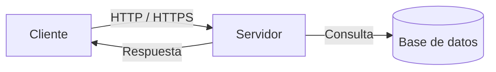

- El **cliente** habitualmente un navegador como Chrome , Firefox  o Edge , solicita recursos y muestra contenido, a partir de código HTML, CSS y JavaScript.
- El **servidor** procesa las peticiones y devuelve contenido, habitualmente HTML, JSON o archivos estáticos.

Pasos en la petición de una página web:

- El usuario introduce una URL o hace clic en un enlace.
- El navegador envía una petición HTTP al servidor.
- El servidor procesa la petición, consulta la base de datos si es necesario y genera una respuesta
- El navegador recibe la respuesta y renderiza la página para el usuario.

Cada interacción del usuario puede generar nuevas peticiones al servidor, que pueden ser síncronas (recargando la página) o asíncronas (actualizando parte del contenido sin recargar).

## 2. Aplicaciones web estáticas y dinámicas

### 2.1 Web estática

Una **web estática** sirve HTML, CSS y JavaScript desde el servidor sin modificar el contenido entre peticiones.

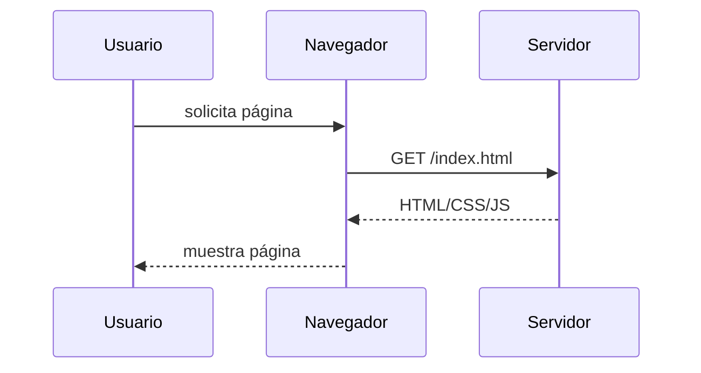

Las páginas estáticas son rápidas y fáciles de servir, pero no cambian según el usuario o los datos. Solo varían si se actualiza el archivo en el servidor. Son adecuadas para sitios informativos, blogs simples o landing pages.

Ventajas y características principales:

- El contenido se almacena en archivos finales (.html, .css, .js, imágenes) y se sirve tal cual al cliente.
- No es necesario programar para crear contenidos básicos; basta con editar los archivos.
- Consumen menos recursos en el servidor y suelen ofrecer mejor rendimiento y SEO cuando el contenido no varía.
- Útiles para secciones que no requieren interacción ni datos dinámicos: contacto, términos, información estática.

Limitaciones:

- Imposible personalizar contenido por usuario o por contexto sin generar páginas adicionales.
- Actualización manual cuando cambia la información, lo que incrementa mantenimiento si hay mucho contenido.

## 2.2 Web dinámica

Una **web dinámica** construye contenido en el servidor en cada petición, usando datos de una base de datos o lógica del servidor.

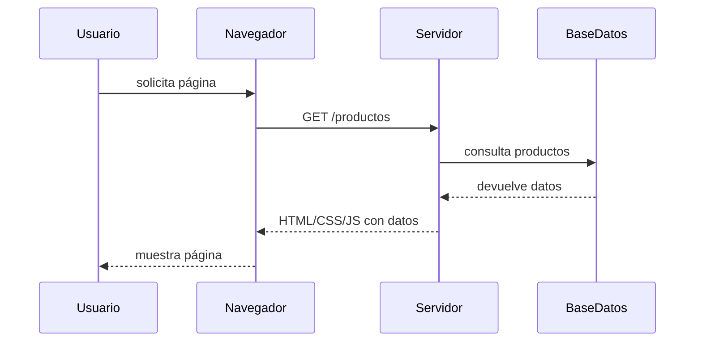

Las páginas dinámicas permiten personalización, interacción y actualización de datos en tiempo real. Son adecuadas para tiendas online, redes sociales o aplicaciones web complejas.

Características y funcionamiento:

- El servidor ejecuta código en lenguajes como PHP, Python, Java, Node.js, etc., y genera HTML al vuelo.
- El contenido puede depender de la hora, del usuario autenticado, de acciones previas o de consultas a bases de datos.
- Al recibir la petición el servidor analiza el archivo solicitado (por ejemplo index.php), ejecuta el código del lenguaje de servidor, accede a la base de datos o a otros recursos y construye el HTML que finalmente se envía al cliente.

Extensiones y ejemplos:

- Archivos típicos: .php, .py, .js (Node), .jsp, .asp.
- Adecuadas para comercios electrónicos, blogs con gestión de usuarios, paneles de administración (back-office) y aplicaciones con lógica de negocio.

Inconvenientes:

- Mayor complejidad de desarrollo y mayor consumo de recursos en el servidor.
- Requieren cuidado adicional para SEO y rendimiento (cache, optimización de consultas, etc.).

## 2.3 Comparación entre web estática y dinámica

| Característica | Web estática | Web dinámica |
| --- | --- | --- |
| Contenido | Fijo, no cambia entre peticiones | Generado al vuelo, puede variar según usuario, hora o datos |
| Lenguajes | HTML, CSS, JS | PHP, Python, Node.js, Java, etc. |
| Base de datos | No requiere | Requiere para almacenar y recuperar datos |
| Rendimiento | Rápida, menos carga en servidor | Más lenta, depende de la lógica y consultas |
| SEO | Fácil de optimizar | Requiere cuidado adicional (renderizado, metaetiquetas dinámicas) |
| Mantenimiento | Simple, editar archivos | Más complejo, requiere gestión de código y base de datos |
| Casos de uso | Blogs simples, landing pages, portafolios | Tiendas online, redes sociales, aplicaciones web interactivas |

## 3. Definiciones clave

- **HTML**: lenguaje de marcado que estructura una página.

  ```html
  <h1>Mi página</h1>
  <p>Bienvenido al sitio.</p>
  ```

- **CSS**: hojas de estilo que definen el aspecto visual.

  ```css
  body {
    font-family: Arial, sans-serif;
    background: #f9f9f9;
  }
  ```

- **JavaScript**: lenguaje que añade comportamiento e interactividad en el navegador.

  ```js
  document.querySelector('button').addEventListener('click', () => {
    alert('¡Has pulsado el botón!');
  });
  ```

- **DOM**: representación en memoria del árbol de elementos HTML.

  ```js
  const titulo = document.getElementById('titulo');
  titulo.textContent = 'Nuevo título';
  ```

- **Framework**: conjunto de herramientas y librerías que facilitan el desarrollo de aplicaciones web, proporcionando estructura y funcionalidades predefinidas.

- **Frontend**: parte de la aplicación que se ejecuta en el cliente (navegador) y que interactúa con el usuario. Consiste en HTML, CSS y JavaScript, y puede usar frameworks como React, Vue o Angular.

  ```jsx
  import React, { useState } from 'react';

  function PulsaBoton() {
    const [count, setCount] = useState(0);
    return (
      <button onClick={() => setCount(count + 1)}>
        Pulsado {count} {count === 1 ? 'vez' : 'veces'}
      </button>
    );
  }

  export default PulsaBoton;
  ```


- **Backend**: parte de la aplicación que se ejecuta en el servidor y que procesa datos, lógica y almacenamiento. Puede estar implementado en PHP, Python, Node.js, Java, etc., y suele usar frameworks como Laravel, Django, Express o Spring.

  ```js
  // Node.js / Express
  app.get('/api/mensaje', (req, res) => {
    res.json({ mensaje: 'Hola desde el servidor' });
  });
  ```

- **Full Stack**: desarrollador o aplicación que abarca tanto frontend como backend.

- **Backoffice**: interfaz de administración de la aplicación, generalmente accesible solo para usuarios autorizados.

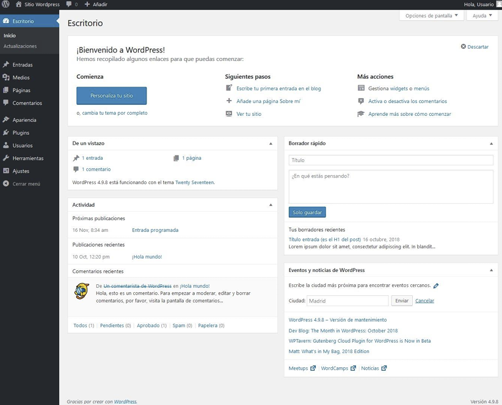

- **HTTP**: protocolo de comunicación entre cliente y servidor. Utiliza métodos para indicar la acción deseada y códigos de estado para informar del resultado.
  Los métodos HTTP más utilizados son:

    - **GET**: solicitar un recurso. Seguro y sin efecto secundario (idempotente cuando no altera estado).
    - **POST**: enviar datos al servidor para crear un recurso o procesar información (no idempotente).
    - **PUT**: reemplazar o crear un recurso en una ubicación concreta (idempotente).
    - **PATCH**: aplicar modificaciones parciales a un recurso (no necesariamente idempotente).
    - **DELETE**: eliminar un recurso (idempotente en la práctica cuando el recurso desaparece).

  Los rangos de códigos de estado son:

    - 1xx Informativos: indican comunicación en progreso (100 Continue, ...).
    - 2xx Éxito: la petición se completó correctamente (200 OK, 201 Created, 204 No Content, ...).
    - 3xx Redirecciones: se requiere acción adicional para completar la petición (301 Moved Permanently, 302 Found, ...).
    - 4xx Errores del cliente: la petición es incorrecta o no autorizada (400 Bad Request, 401 Unauthorized, 403 Forbidden, 404 Not Found, ...).
    - 5xx Errores del servidor: fallo en el servidor al procesar la petición (500 Internal Server Error, 502 Bad Gateway, 503 Service Unavailable, ...).

  Las respuestas incluyen un código de estado que indica el resultado y, opcionalmente, un cuerpo con más información.

- **JSON**: formato de datos ligero usado para intercambiar información, consistente en pares clave-valor.

  ```json
  {
    "productos": [
      {
        "producto": "Camiseta",
        "precio": 19.99
      },
      {
        "producto": "Pantalones",
        "precio": 39.99
      }
    ]
  }
  ```

- **API REST**: interfaz que permite al Frontend comunicarse con el Backend para intercambiar recursos en formato JSON mediante el protocolo HTTP.

  Ejemplo de petición:
  
  ```http
  GET /api/productos HTTP/1.1
  Host: ejemplo.com
  ```

  Ejemplo de respuesta:

  ```http
  HTTP/1.1 200 OK
  Content-Type: application/json; charset=utf-8
  Content-Length: 48

  {
    "productos": [
      { "id": 1, "nombre": "Camiseta", "precio": 19.99 },
      { "id": 2, "nombre": "Pantalones", "precio": 39.99 }
    ]
  }
  ```

---

## 4. Comunicación síncrona vs. asíncrona y AJAX

En la web tradicional, la comunicación entre cliente y servidor es **síncrona**. Cuando el usuario realiza una acción (por ejemplo, enviar un formulario o hacer clic en un enlace), el navegador bloquea la interfaz, realiza la petición y espera a que el servidor devuelva un documento HTML completo para recargar toda la página.

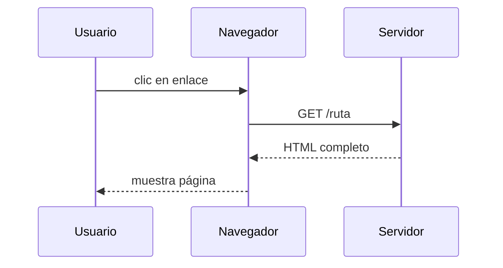

Para evitar estas recargas completas y ofrecer una experiencia más fluida, surge **AJAX** (*Asynchronous JavaScript and XML*). AJAX permite hacer peticiones asíncronas desde JavaScript, de forma que la página puede actualizar parte de su contenido sin recargar todo el documento.

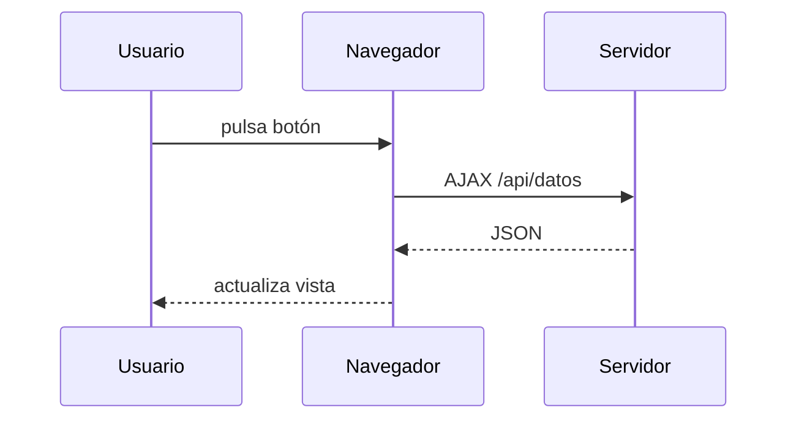

Algunos ejemplos típicos de AJAX incluyen formularios que se envían sin recargar la página, actualizaciones de contenido en tiempo real (como botones "me gusta" o notificaciones), autocompletado en buscadores y carga de datos adicionales al hacer scroll (*infinite scroll*).

Entre las ventajas de AJAX destacan:

- Mejor experiencia de usuario (UX), ya que la interfaz no se bloquea.
- Reducción de ancho de banda, al no recargar recursos estáticos.
- Permite crear aplicaciones web más interactivas y dinámicas.

Para que una comunicación asíncrona AJAX funcione eficientemente, el cliente y el servidor necesitan un "idioma común" para intercambiar datos estructurados. Para ello, se utiliza **JSON** con interfaces **API REST**, donde el cliente hace peticiones HTTP a rutas específicas y el servidor responde con datos en formato JSON.

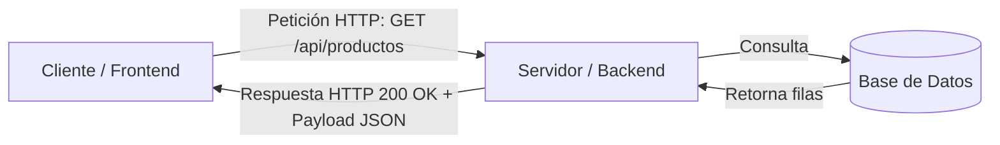

---

## 5. Modelos de arquitectura de renderizado

La forma en que combinamos la generación de HTML (servidor vs. cliente) y el tipo de comunicación (síncrona vs. asíncrona) da lugar a dos grandes filosofías de desarrollo web:

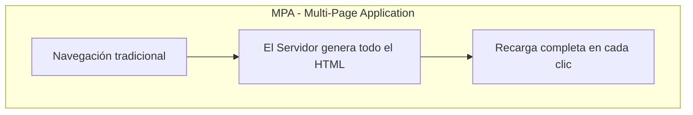

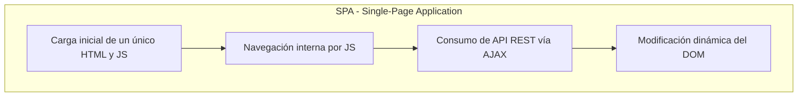

Vídeo recomendado:

[](https://www.youtube.com/watch?v=2z0FChkphvo)

### 5.1 MPA (Multi-Page Application)

Es el modelo clásico del desarrollo web. Cada vez que el usuario navega a una nueva sección, el servidor procesa la petición, consulta la base de datos y renderiza en el servidor (SSR, Server Side Rendering) una nueva página HTML completa.

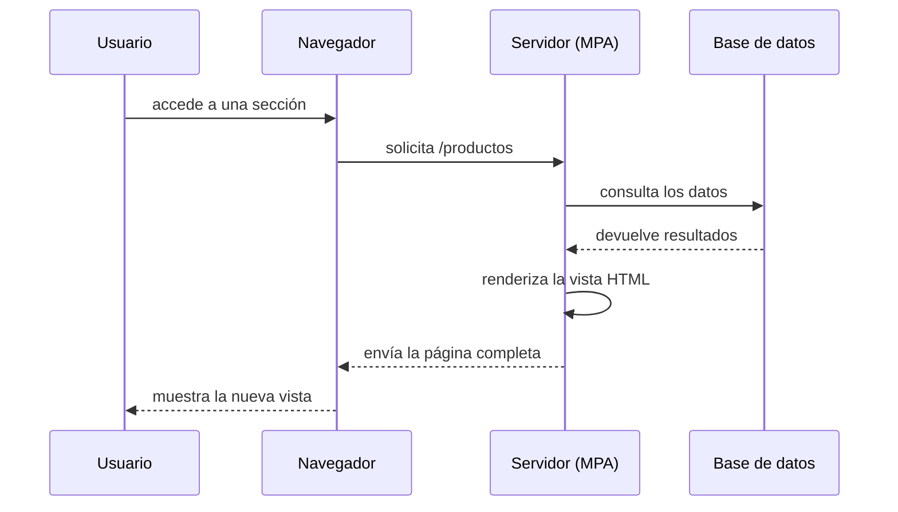

Algunas de las tecnologías backend que se usan en los servidores MPA son:

| Framework servidor | Lenguaje |
| --- | --- |
| Laravel  | PHP  |
| Spring  | Java  |
| Django  | Python  |
| Express  | Node.js  |
| Ruby on Rails  | Ruby  |
| ASP.NET  | .NET  |

Entre las características de MPA destacan:

- El servidor genera el HTML de cada página.
- El navegador recibe contenido listo para mostrar.
- La navegación recarga el documento completo.
- Es adecuado para sitios informativos y aplicaciones con formularios tradicionales.

### 5.2 SPA (Single Page Application)

Es una aplicación web de una sola página. El servidor entrega un HTML sin datos inicial junto con un paquete de JavaScript (usando frameworks como React, Vue o Angular). A partir de ahí, el navegador mantiene la página activa: cuando el usuario navega, JavaScript simula el cambio de página y pide datos al backend mediante AJAX a una API REST, modificando el DOM al vuelo.

En una SPA, el navegador carga una sola página inicial y el cliente maneja el enrutado y las vistas.

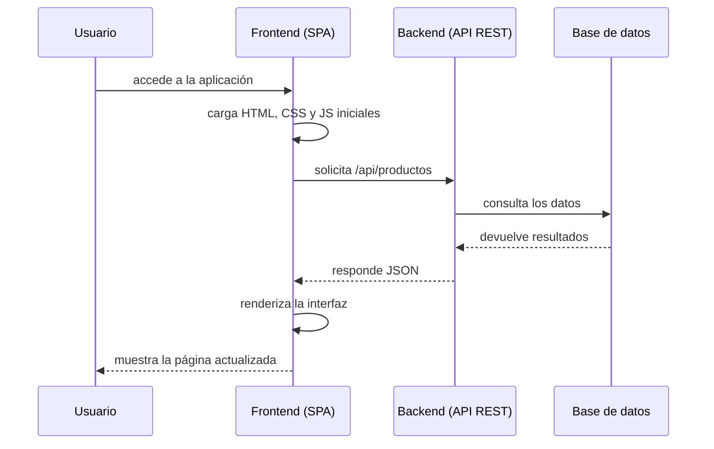

Algunas de las tecnologías frontend que se basan en el funcionamiento SPA son:

| Framework cliente | Lenguaje |
| --- | --- |
| React  | JavaScript  |
| Vue  | JavaScript  |
| Angular  | TypeScript  |

Entre las características de SPA destacan:

- El servidor entrega un HTML base y scripts.
- El cliente usa JavaScript y AJAX para actualizar contenido.
- La primera carga puede ser más pesada.
- Buena para aplicaciones con mucha interacción y estado en el cliente.

## 5.3. Comparación de modelos

| Criterio | MPA (Multi-Page Application) | SPA (Single-Page Application) |
| --- | --- | --- |
| Generación de HTML | En el servidor (Server-Side Rendering) | En el cliente mediante JavaScript |
| Navegación | Recarga de página completa | Transición fluida sin recarga de navegador |
| Manejo de Estado | El servidor gestiona el estado (Sesiones) | El cliente guarda el estado en memoria |
| Posicionamiento SEO | Excelente de forma nativa | Requiere configuraciones adicionales |
| Complejidad de desarrollo | Menor (ideal para la base del módulo) | Mayor (requiere separar Frontend y Backend) |
| Casos de uso ideales | Sitios corporativos, blogs, e-commerce, paneles de gestión | Redes sociales, plataformas SaaS, dashboards muy interactivos |

---

## 6. Arquitecturas backend

El patrón MVC tiene especial importancia en UD01, porque Laravel y otros frameworks lo usan.

### 6.1 MVC (Modelo-Vista-Controlador)

MVC separa responsabilidades:

- **Modelo**: representa los datos y el acceso a la base de datos.
- **Vista**: genera la plantilla HTML que ve el usuario.
- **Controlador**: recibe la petición, pide datos al modelo y devuelve la vista.

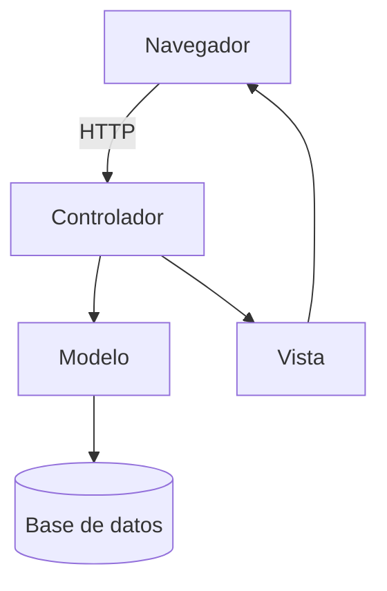

En Laravel, el flujo típico es:

- `routes/web.php` define la ruta.
- El controlador procesa la petición.
- El modelo consulta la base de datos.
- La vista devuelve HTML.

MVC mejora el mantenimiento y facilita el trabajo colaborativo.

### 6.2 Monolito

Un monolito agrupa toda la aplicación en una sola unidad desplegada.

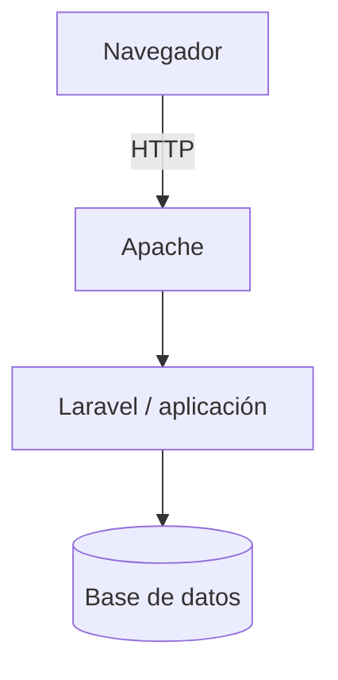

- Fácil de desplegar y entender en fases iniciales.
- Ideal para proyectos pequeños o prototipos.

### 6.3 N-capas

La arquitectura n-capas separa presentación, lógica y datos.

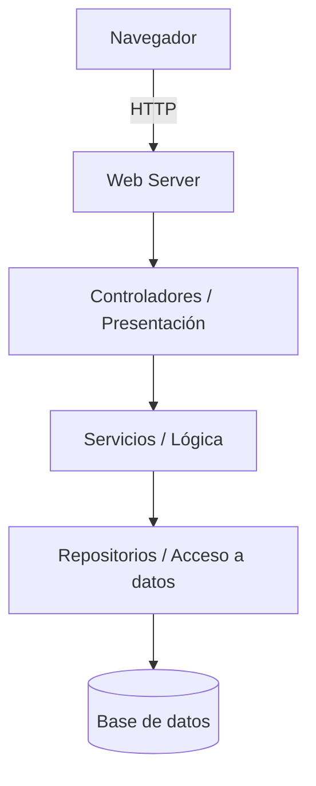

- Mejora la mantenibilidad.
- Facilita pruebas y evolución independiente de cada capa.

### 6.4 Microservicios

Los microservicios dividen la aplicación en servicios pequeños e independientes.

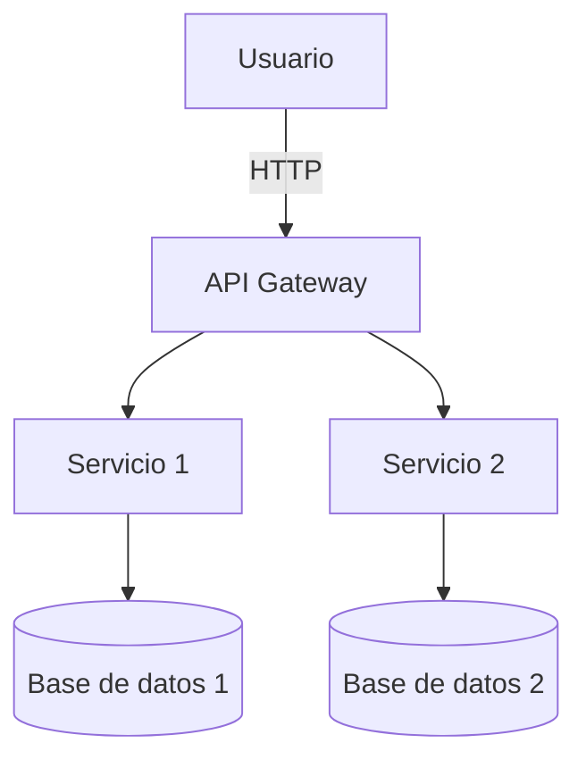

- Apto para sistemas grandes y equipos separados.
- Requiere más complejidad operativa.

### 6.5 Serverless

Serverless ejecuta funciones bajo demanda sin gestionar servidores.

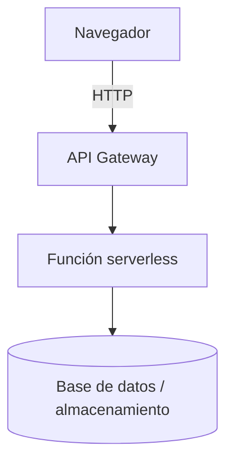

- Pago por uso real.
- Útil para tareas puntuales o cargas variables.
- Menos control sobre el servidor.

---

## 7. Entorno de desarrollo

En UD01 el entorno preferido es:

- **Backend**: PHP + Laravel
- **Servidor web**: Apache
- **Base de datos**: MySQL/MariaDB o SQLite en desarrollo
- **Editor**: VSCode

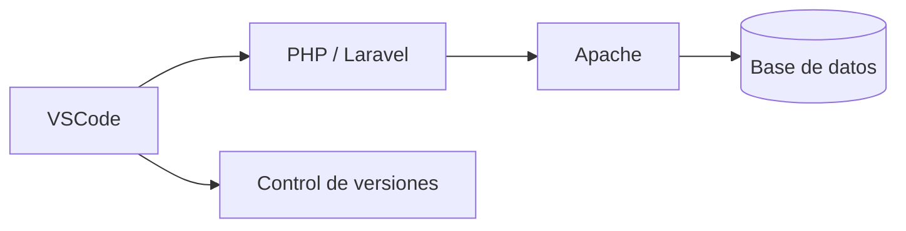

Laravel es un framework MVC que encaja bien con el enfoque de este módulo.

---

## 8. Conclusión

Esta propuesta simplifica los modelos de renderizado a los tres más relevantes para UD01 y da importancia al patrón MVC en las arquitecturas backend. El objetivo es ofrecer una base clara para distinguir entre aplicaciones estáticas y dinámicas, entender cuándo usar cada modelo y cómo organizar el backend con Laravel y VSCode.
