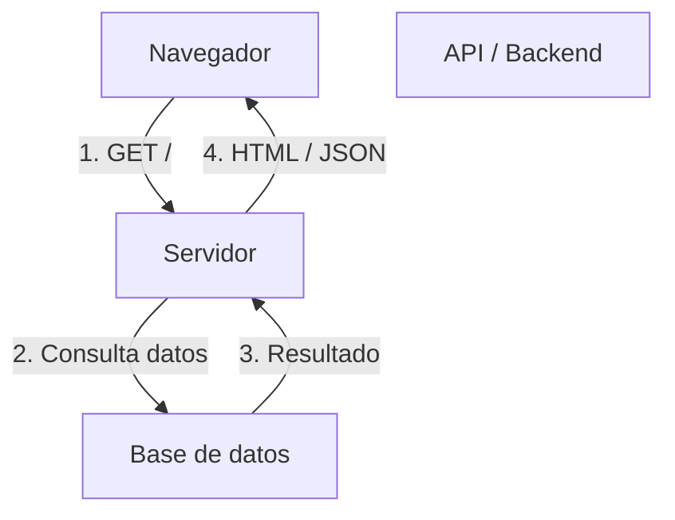

# Propuesta de arquitectura web para UD01

Esta propuesta aporta una visión estructurada de la unidad UD01, basada en guías modernas de arquitectura web y alineada con la clasificación de MPA, SPA, SSR e Headless que ya hemos trabajado.

## 1. ¿Por qué la arquitectura web importa?

- La arquitectura determina cómo se divide el trabajo entre cliente y servidor.
- Influye en el rendimiento, SEO, experiencia de usuario y en cómo se despliega la aplicación.
- Una arquitectura adecuada facilita la escalabilidad, el mantenimiento y la integración con otros servicios.

## 2. Componentes esenciales de una aplicación web

Una aplicación web normalmente está formada por estos elementos:

- **Cliente**: el navegador o la app que visualiza la interfaz.
- **Servidor**: procesa peticiones, ejecuta lógica y prepara respuestas.
- **API / backend**: expone datos y servicios en formato JSON, XML o REST.
- **Base de datos**: almacena información persistente.
- **Capa de presentación**: HTML, CSS y JavaScript que muestran la interfaz.
- **Capa de infraestructura**: CDN, balanceadores, caché, autenticación y despliegue.

### 2.1 Flujo básico de una petición web

## 3. Modelos de renderizado y clasificación

Esta clasificación parte de la comparación entre MPA, SPA, SSR e Headless, pero se completa con conceptos modernos:

| Modelo | Qué hace el servidor | Qué hace el cliente | Ventajas | Cuándo usarlo |
|---|---|---|---|---|
| **MPA** | Genera HTML completo para cada petición | Recarga la página al navegar | Simple, SEO natural, fácil de depurar | Sitios informativos, intranets, formularios | 
| **SPA** | Entrega HTML/JS inicial y APIs | Renderiza rutas en el cliente | Navegación muy fluida, experiencia app | Aplicaciones interactivas y paneles | 
| **SSR** | Renderiza HTML en el servidor y lo hidrata | Hidrata la interfaz y gestiona interactividad | SEO mejorado, primera carga rápida | Contenido dinámico y comercio electrónico | 
| **Híbrido** | Combina SSR y SPA según la página | Puede cargar JS para partes interactivas | Flexibilidad, mejor performance y SEO | Aplicaciones mixtas modernas | 
| **Headless / API-first** | Solo expone datos como API | Usa un frontend independiente | Buena reutilización, múltiples clientes | Apps con web, móvil y dispositivos IoT |

## 4. Estilos de arquitectura de backend

Más allá del renderizado, existen estilos de arquitectura que afectan la organización interna:

| Estilo | Descripción | Ejemplos | Ideal para |
|---|---|---|---|
| **Monolítico** | Todo el backend en una sola aplicación | PHP clásico, Django, Rails | Proyectos pequeños / equipo reducido |
| **N-capas** | Separación de presentación, lógica y datos | MVC, servicios de datos | Mantenimiento claro y escalable |
| **Microservicios** | Servicios pequeños e independientes | APIs, contenedores | Sistemas grandes y distribuidos |
| **Serverless** | Funciones bajo demanda | AWS Lambda, Azure Functions | Picos de carga y desarrollo rápido |

## 5. Propuesta de contenido para UD01

1. Introducción a la arquitectura web
   - Qué es una aplicación web
   - Componentes básicos y flujo de datos
2. Modelos de renderizado
   - MPA
   - SPA
   - SSR
   - Híbrido
   - Headless
3. Estilos de arquitectura backend
   - Monolito
   - N-capas
   - Microservicios
   - Serverless
4. Comparación práctica
   - Tablas de ventajas, límites y casos de uso
   - Ejemplos reales
5. Selección de arquitectura
   - Criterios: SEO, velocidad, complejidad, equipo, despliegue
   - Ejemplo de decisión: pequeña web, app de datos, e-commerce

## 6. Mejora respecto a la clasificación anterior

- Añadimos el concepto de **arquitectura back-end** (monolito, n-capas, microservicios, serverless).
- Separamos mejor el **renderizado** (MPA, SPA, SSR, híbrido, Headless) del **estilo de servicio**.
- Incluimos criterios de elección basados en rendimiento, SEO y experiencia de usuario.
- Proponemos un orden didáctico: primero entender el flujo, luego los modelos de renderizado y, por último, la arquitectura del backend.

## 7. Referencias usadas

- SoftKraft — Web Application Architecture: Guide & Diagrams
- GeeksforGeeks — How Web Works: Web Application Architecture for Beginners
- Hackr.io — Web Application Architecture: Types, Components, and Models Explained
- Microsoft Learn — Common web application architectures

---

> Esta propuesta puede servir como base para un segundo documento de UD01 que explique la arquitectura desde la práctica, con diagramas, ejemplos y decisiones de diseño.
