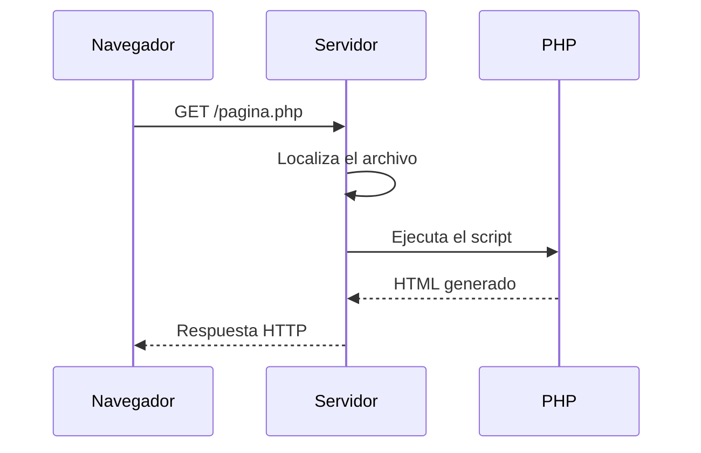

# UD02: Introducción a PHP

PHP es un lenguaje de programación de propósito general cuyo uso se ha extendido especialmente en el desarrollo web. En esta unidad se estudian sus fundamentos y la forma en la que un servidor procesa scripts PHP para generar documentos HTML.

## Objetivos

- Comprender qué es PHP y cómo se integra en HTML.
- Escribir scripts con variables, constantes, tipos de datos y operadores.
- Utilizar estructuras de control, arrays y funciones.
- Reutilizar código mediante la inclusión de ficheros.
- Aplicar una primera guía de estilo y documentar el código con PHPDoc.

## 1. PHP

PHP es un lenguaje de programación de propósito general:

- Se utiliza principalmente en el desarrollo web.
- Su sintaxis es similar a la de C y Java.
- Es un lenguaje interpretado.

La referencia principal para consultar la sintaxis y las funciones del lenguaje es la [documentación oficial de PHP](https://www.php.net/manual/es). En ella también se indican las versiones compatibles de cada función.

## 2. Integración de PHP en HTML

Los archivos que contienen código PHP tienen la extensión `.php` y habitualmente se denominan *scripts*. Un script PHP es un documento HTML que puede contener bloques de código PHP que el servidor ejecutará antes de enviar la respuesta al navegador.

Los bloques PHP se delimitan con `<?php` y `?>`:

```php
<?php
echo 'Desarrollo Web Entorno Servidor';
?>
```

Las expresiones PHP deben terminar con punto y coma (`;`). Un script puede contener:

- Solo HTML.
- Solo PHP.
- PHP que genera HTML.
- Una combinación de HTML y PHP.

Cuando un archivo contiene únicamente código PHP, se recomienda omitir el delimitador de cierre `?>`. Así se evitan espacios o líneas accidentales al final del archivo.

### 2.1. Generar HTML desde PHP

El código PHP se ejecuta en el servidor. El resultado que recibe el navegador es HTML, no el código PHP original. Hay tres formas habituales de generar contenido:

```php
<?php
echo $name;
print $name;
?>

<?= $name ?>
```

`echo` y `print` no son funciones, por lo que no necesitan paréntesis. La sintaxis corta `<?= ... ?>` se utiliza fuera de un bloque PHP. El operador punto (`.`) permite concatenar cadenas:

```php
<?php
$name = 'Álex Torres';
echo 'Hola, soy ' . $name;
?>
```

Como PHP se utiliza con frecuencia para generar HTML, se recomienda utilizar comillas simples para las cadenas y reservar las comillas dobles para los atributos HTML. Una comilla simple dentro de una cadena se escapa con `\'`.

### 2.2. Flujo de una petición PHP

Cuando el servidor recibe una petición de un archivo `.php`, realiza, de forma simplificada, estos pasos:

1. Busca el archivo solicitado. Si no existe, devuelve un error 404.
2. Procesa las inclusiones y obtiene el script con el código necesario.
3. Carga en memoria las funciones, métodos y clases que encuentra.
4. Interpreta el script línea a línea.
5. Copia el HTML directamente a la salida y ejecuta los bloques PHP, que pueden añadir más HTML.
6. Envía al navegador el documento HTML resultante.



### 2.3. Caché del navegador

Los servidores y los navegadores utilizan memoria caché. En ocasiones los cambios tardan en visualizarse. Durante las prácticas se puede indicar que la respuesta expire inmediatamente:

```html
<meta http-equiv="expires" content="Sat, 07 Feb 2016 00:00:00 GMT">
```

## 3. Comentarios y PHPDoc

Los comentarios de PHP no aparecen en el HTML final. Los comentarios de una línea pueden escribirse con `//` o `#`, y los comentarios de varias líneas con `/* ... */`:

```php
// Comentario de una línea

/*
 * Comentario de varias líneas.
 */
```

Los comentarios HTML (`<!-- ... -->`), en cambio, sí llegan al navegador.

### 3.1. Documentación PHPDoc

PHPDoc permite documentar el código de forma estructurada para que el IDE lo reconozca y para generar documentación automáticamente. Es similar a JavaDoc.

Como norma de trabajo de la unidad:

- Los nombres de variables, funciones, métodos y clases se escriben en inglés.
- Los nombres de los archivos se escriben en inglés.
- Cada archivo debe comenzar con un bloque PHPDoc que incluya, al menos, `@author` y `@version`.
- Cada clase y cada método debe tener su propio bloque PHPDoc.
- El código debe ser autoexplicativo; los algoritmos complejos deben incluir una explicación adicional.

Ejemplo de documentación de un archivo y una función:

```php
<?php
/**
 * Utility functions for price calculations.
 *
 * @author Alex Torres
 * @version 1.0
 */

/**
 * Adds two numbers.
 *
 * @param float $firstNumber First operand.
 * @param float $secondNumber Second operand.
 * @return float Sum of both operands.
 */
function addition(float $firstNumber, float $secondNumber): float
{
 return $firstNumber + $secondNumber;
}
```

También se recomienda documentar los archivos incluidos, las clases, interfaces, traits, funciones, métodos, propiedades y constantes.

Para generar documentación HTML con phpDocumentor se puede utilizar el archivo `phpDocumentor.phar`:

```bash
php phpDocumentor.phar -d . -t docs/api
```

## 4. Inclusión de ficheros externos

La inclusión permite reutilizar clases, funciones, cabeceras, pies de página y otras secciones de una aplicación. PHP dispone de cuatro instrucciones principales:

```php
<?php
include $_SERVER['DOCUMENT_ROOT'] . '/includes/header.inc.php';
include_once $_SERVER['DOCUMENT_ROOT'] . '/includes/functions.inc.php';

require $_SERVER['DOCUMENT_ROOT'] . '/includes/config.inc.php';
require_once $_SERVER['DOCUMENT_ROOT'] . '/includes/database.inc.php';
```

Todas incorporan el contenido del archivo en el punto donde se ejecutan. La diferencia principal es el comportamiento cuando el archivo no existe:

| Instrucción | Si el archivo no existe | Uso habitual |
| --- | --- | --- |
| `include` | Muestra una advertencia y continúa | Contenido no imprescindible |
| `include_once` | Igual que `include`, pero solo una vez | Funciones o plantillas opcionales |
| `require` | Muestra un error y detiene la ejecución | Dependencias imprescindibles |
| `require_once` | Igual que `require`, pero solo una vez | Configuración, clases o librerías |

Los archivos pensados para ser incluidos suelen utilizar la extensión `.inc.php` y se guardan en una carpeta `includes` situada en la raíz de la aplicación. Por ejemplo:

```text
includes/
├── header.inc.php
├── footer.inc.php
└── functions.inc.php
```

Esta técnica evita copiar la misma cabecera, menú, pie y estilos en todas las páginas de una aplicación web.

## 5. Tipos de datos

PHP dispone de los siguientes tipos de datos básicos:

| Tipo | Descripción | Ejemplo |
| --- | --- | --- |
| `bool` | Verdadero o falso | `false` |
| `int` | Número sin decimales | `58` |
| `float` | Número con decimales | `4.7` |
| `string` | Cadena delimitada por comillas | `'Rick Sanchez'` |
| `array` | Conjunto de valores | `['Rick', 'Sanchez', 70]` |
| `null` | Ausencia de valor | `null` |

Los valores booleanos se escriben como `true` o `false`, sin distinguir mayúsculas y minúsculas. En un contexto booleano se consideran falsos `false`, `0`, `-0`, `0.0`, `-0.0`, `'0'`, `''` y `null`. También se considera falso un array vacío.

## 6. Variables

Las variables almacenan datos. Su nombre comienza por `$` y después debe aparecer una letra o `_`. Los nombres distinguen mayúsculas y minúsculas, por lo que `$name` y `$Name` son variables diferentes.

```php
<?php
$age = 20;
$quantityOfBalls = 5;
$_floor = 2;
$_3types = ['int', 'float', 'string'];
```

PHP tiene tipado débil y dinámico:

- Una variable comienza a existir cuando recibe un valor.
- Su tipo puede cambiar durante la ejecución.

```php
<?php
$variable = 5;
$variable = 'Morty';
$variable = true;
```

El operador `=` asigna un valor. Para eliminar una variable se utiliza `unset()`:

```php
<?php
$name = 'Rick';
unset($name);
```

### 6.1. Casting y conversión automática

El *casting* convierte explícitamente un dato a otro tipo:

```php
<?php
$price = 3.95;
$integerPrice = (int) $price;
```

El *type juggling* es la conversión automática que PHP intenta realizar cuando una operación combina datos de tipos diferentes.

## 7. Constantes

Las constantes almacenan valores que no deben cambiar durante la ejecución. Por convención, sus nombres se escriben en mayúsculas. Se pueden declarar con `define()` o con `const`:

```php
<?php
define('PI', 3.141592);
const SCHOOL_NAME = 'DAW';
```

PHP también dispone de [constantes predefinidas](https://www.php.net/manual/es/language.constants.predefined.php).

## 8. Fechas y horas

La función `time()` devuelve el instante actual como marca de tiempo UNIX: los segundos transcurridos desde las 00:00:00 del 1 de enero de 1970.

```php
<?php
$start = time();
// Instrucciones del programa.
echo 'Página generada en ' . (time() - $start) . ' segundos';
```

Actualmente se recomienda utilizar la clase `DateTime`, que es más flexible y sencilla:

```php
<?php
date_default_timezone_set('Europe/Madrid');

$now = new DateTime();
echo $now->format('Y-m-d H:i:s');
```

Algunos caracteres de formato son:

| Código | Significado |
| --- | --- |
| `Y` | Año con cuatro cifras |
| `m` | Mes con dos cifras |
| `d` | Día |
| `H` | Hora en formato de 24 horas |
| `i` | Minutos |
| `s` | Segundos |

Los métodos `modify()`, `setDate()` y `setTime()` permiten cambiar el valor de un objeto `DateTime`. El método `diff()` calcula la diferencia entre dos fechas:

```php
<?php
$firstDate = new DateTime('2001-09-10');
$secondDate = new DateTime('2025-12-25');
$interval = $firstDate->diff($secondDate);

echo $interval->format('%m meses y %d días');
```

Si el servidor está configurado en una zona horaria diferente, se debe establecer explícitamente `Europe/Madrid` al principio de los scripts que trabajen con fechas y horas.

## 9. Expresiones y operadores

Los operadores permiten realizar operaciones con variables y construir expresiones. La prioridad general es: paréntesis, negación, producto y división, suma y resta, comparación, operadores lógicos y asignación. Cuando sea necesario, se deben usar paréntesis para hacer explícita la intención.

| Tipo | Operadores |
| --- | --- |
| Asignación | `=`, `+=`, `-=`, `*=`, `/=`, `%=` |
| Aritmética | `+`, `-`, `*`, `/`, `%`, `**`, `++`, `--` |
| Comparación | `>`, `<`, `>=`, `<=`, `==`, `!=`, `<>`, `!==`, `===`, `<=>`, `??` |
| Lógica | `&&`, `||`, `!`, `and`, `or`, `xor` |
| Bits | `&`, `|`, `^`, `~`, `<<`, `>>` |
| Concatenación | `.`, `.=` |

Se recomienda utilizar `===` y `!==` cuando se necesite comparar también el tipo de los valores.

### 9.1. Operador nave espacial

El operador `<=>` compara dos valores y devuelve `-1` si el primero es menor, `0` si son iguales y `1` si es mayor:

```php
<?php
$comparison = $firstValue <=> $secondValue;
```

### 9.2. Fusión de null

El operador `??` devuelve el primer operando de izquierda a derecha que no sea `null`:

```php
<?php
$displayName = $userName ?? $defaultName ?? 'Guest';
```

## 10. Ámbito de las variables

Una variable puede pertenecer a tres ámbitos:

- **Local al script**: se puede utilizar en el resto del script, también si se creó dentro de una estructura de control, pero no dentro de una función.
- **Local a una función**: se crea y utiliza dentro de la función.
- **Global**: una variable del script se importa en una función mediante `global`.

```php
<?php
$name = 'Alex';

function greeting(): void
{
 global $name;
 echo 'Hello, ' . $name;
}
```

Se debe evitar el uso de variables globales. Es preferible pasar los datos necesarios como argumentos y devolver el resultado mediante `return`.

## 11. Estructuras de control

Las estructuras de control alteran el flujo de ejecución. PHP dispone de `if`, `switch`, `while`, `do-while` y `for`.

### 11.1. `if`, `else if` y `else`

```php
<?php
if ($number < 0) {
 echo 'El número es negativo.';
} elseif ($number > 0) {
 echo 'El número es positivo.';
} else {
 echo 'El número es cero.';
}
```

### 11.2. Operador ternario

El operador ternario es una forma abreviada de `if-else`:

```php
<?php
$message = $score >= 5 ? 'Aprobado' : 'Suspenso';
```

Combinado con fusión de `null` resulta útil para valores opcionales:

```php
<?php
echo 'Welcome ' . ($userName ?? 'Guest') . '!';
```

### 11.3. `switch`

`switch` permite ejecutar un bloque según el valor de una expresión. `break` evita continuar ejecutando los casos siguientes y `default` gestiona los valores no contemplados:

```php
<?php
$number = random_int(0, 2);

switch ($number) {
 case 0:
  echo 'El número vale 0.';
  break;
 case 1:
  echo 'El número vale 1.';
  break;
 default:
  echo 'El número no vale ni 0 ni 1.';
}
```

### 11.4. Bucles

`while` comprueba la condición antes de cada iteración. `do-while` ejecuta el cuerpo al menos una vez. `for` agrupa inicialización, condición y actualización:

```php
<?php
$number = 1;
while ($number < 8) {
 $number += 3;
}

$number = 5;
do {
 $number -= 3;
} while ($number > 10);

for ($index = 0; $index < 10; $index++) {
 echo $index . '<br>';
}
```

## 12. Arrays

En PHP, un array es un mapa ordenado de pares clave-valor. Puede emplearse como lista, tabla hash, diccionario, pila o cola. No tiene un tamaño fijo: se pueden añadir y eliminar elementos en cualquier momento.

### 12.1. Arrays numéricos y asociativos

Si no se indica una clave, PHP asigna índices enteros empezando por cero:

```php
<?php
$suits = array('Hearts', 'Diamonds', 'Clubs', 'Spades');
$characters = ['Rick', 'Morty', 'Summer', 'Beth'];

echo $suits[0];
echo $characters[3];
```

Un array asociativo utiliza claves de texto:

```php
<?php
$character = [
 'name' => 'Rick Sanchez',
 'age' => 70,
 'height' => 1.98,
];

echo $character['name'];
```

Un array mixto combina claves enteras y de texto. Puede resultar útil cuando una función, por ejemplo una función de acceso a datos, devuelve ambos tipos de clave, pero debe utilizarse con cuidado para evitar confusiones.

PHP intenta convertir algunas claves a enteros. Por ejemplo, las claves `1`, `'1'`, `1.5` y `true` pueden acabar representando la misma clave `1`.

### 12.2. Añadir, eliminar y recorrer elementos

```php
<?php
$characters = ['Luke', 'Leia'];
$characters[] = 'Han Solo';
$characters[3] = 'Darth Vader';

unset($characters[1]);
$characters = array_values($characters);
```

Al eliminar un elemento de un array numérico quedan índices vacíos. `array_values()` los vuelve a numerar desde cero.

Un array puede contener valores de tipos diferentes y otros arrays, por lo que también se pueden crear estructuras multidimensionales:

```php
<?php
$numbers = [[1, 2, 3], [4, 5, 6], [7, 8, 9]];
echo $numbers[1][2];
```

`count()` devuelve el número de elementos de un array. Para recorrer arrays numéricos o asociativos se recomienda `foreach`:

```php
<?php
$suits = ['Hearts', 'Diamonds', 'Clubs', 'Spades'];

foreach ($suits as $suit) {
 echo '<li>' . $suit . '</li>';
}

foreach ($character as $key => $value) {
 echo $key . ': ' . $value . '<br>';
}
```

Para modificar los elementos originales hay que trabajar con sus claves o utilizar una referencia:

```php
<?php
$numbers = [1, 32, 6, 8];

foreach ($numbers as $key => $number) {
 $numbers[$key]++;
}
```

## 13. Funciones predefinidas

PHP ofrece una gran cantidad de funciones integradas. Antes de utilizar una función se debe consultar la [referencia oficial de funciones](https://www.php.net/manual/es/funcref.php), su signatura y las versiones compatibles.

### 13.1. Funciones para variables

| Función | Descripción |
| --- | --- |
| `empty` | Comprueba si una variable está vacía. |
| `isset` | Comprueba si existe y no es `null`. |
| `unset` | Elimina una o más variables. |
| `is_int` | Comprueba si es un entero. |
| `is_float` | Comprueba si es un decimal. |
| `is_string` | Comprueba si es una cadena. |
| `is_array` | Comprueba si es un array. |
| `is_object` | Comprueba si es un objeto. |
| `is_null` | Comprueba si es `null`. |

### 13.2. Funciones matemáticas

| Función | Descripción |
| --- | --- |
| `pow` | Calcula una potencia. |
| `sqrt` | Calcula una raíz cuadrada. |
| `round` | Redondea al valor más cercano. |
| `ceil` | Redondea hacia arriba. |
| `floor` | Redondea hacia abajo. |
| `decbin` | Convierte un decimal a binario en forma de cadena. |
| `bindec` | Convierte una cadena binaria a decimal. |
| `max` | Obtiene el valor máximo. |
| `min` | Obtiene el valor mínimo. |
| `sin`, `cos`, `tan` | Funciones trigonométricas. |
| `rand`, `mt_rand` | Generan números aleatorios. |

### 13.3. Funciones para strings

| Función | Descripción |
| --- | --- |
| `strlen` | Obtiene la longitud de una cadena. |
| `substr` | Devuelve una parte de una cadena. |
| `str_replace` | Sustituye una cadena por otra. |
| `strtolower` | Convierte a minúsculas. |
| `strtoupper` | Convierte a mayúsculas. |
| `trim` | Elimina espacios al principio y al final. |
| `explode` | Divide una cadena y devuelve un array. |
| `implode` | Une los elementos de un array en una cadena. |
| `strip_tags` | Elimina etiquetas HTML. |
| `strcmp` | Compara dos cadenas. |
| `strcasecmp` | Compara dos cadenas ignorando mayúsculas y minúsculas. |

### 13.4. Funciones para arrays

| Función | Descripción |
| --- | --- |
| `count` | Cuenta los elementos. |
| `array_values` | Devuelve los valores. |
| `array_keys` | Devuelve las claves. |
| `array_key_exists` | Comprueba si existe una clave. |
| `array_flip` | Intercambia claves y valores. |
| `array_pop` | Extrae el último elemento. |
| `array_push` | Añade elementos al final. |
| `array_shift` | Extrae el primer elemento. |
| `array_unshift` | Añade elementos al principio. |
| `array_reverse` | Invierte el orden. |
| `array_merge` | Combina arrays. |
| `in_array` | Comprueba si existe un valor. |
| `sort` | Ordena un array. |

## 14. Funciones propias

Las funciones propias se definen con la palabra reservada `function`. Deben estar definidas en el mismo script desde el que se llaman, directamente o mediante `include` o `require`.

```php
<?php
/**
 * Returns the sum of two numbers.
 *
 * @param int $firstNumber First operand.
 * @param int $secondNumber Second operand.
 * @return int Sum of both operands.
 */
function addition(int $firstNumber, int $secondNumber): int
{
 return $firstNumber + $secondNumber;
}

echo addition(14, 27);
```

### 14.1. Paso por valor y por referencia

Por defecto, los argumentos se pasan por valor: la función trabaja con una copia. Para modificar la variable original se utiliza `&` y se pasa por referencia:

```php
<?php
function increment(int &$number, int $quantity): void
{
 $number += $quantity;
}

$number = 6;
increment($number, 25);
```

### 14.2. Argumentos opcionales y con nombre

Un argumento puede tener un valor por defecto. Los argumentos opcionales deben situarse al final:

```php
<?php
function finalPrice(float $price, float $vat = 21, float $discount = 0): float
{
 $price -= $price * $discount / 100;
 return $price + $price * $vat / 100;
}

finalPrice(150);
finalPrice(150, 10);
finalPrice(150, 10, 50);
```

Desde PHP 8 se pueden indicar argumentos por su nombre. Cuando se mezclan argumentos posicionales y con nombre, los argumentos con nombre deben aparecer al final:

```php
<?php
finalPrice(price: 150, discount: 15);
finalPrice(93, discount: 7, vat: 10);
finalPrice(discount: 15, price: 199, vat: 21);
```

### 14.3. Cantidad variable de argumentos

PHP permite recibir argumentos adicionales con `func_num_args()` y `func_get_arg()`, o con el operador `...` (*variadic arguments*):

```php
<?php
function addition(int ...$numbers): int
{
 $result = 0;

 foreach ($numbers as $number) {
  $result += $number;
 }

 return $result;
}

echo addition(14, 27, 52, 9, 14);
```

También se puede expandir un array para pasarlo como argumentos separados:

```php
<?php
$numbers = [1, 2, 3, 4, 5];
echo addition(...$numbers);
```

Es posible combinar argumentos normales con una lista variádica, siempre dejando `...$values` al final de la definición.

### 14.4. Tipos de parámetros y retorno

Desde PHP 7 se pueden indicar los tipos de los argumentos y del valor devuelto. Esto hace que el código sea más estricto y fácil de entender. Los tipos más habituales son `int`, `float`, `string`, `array`, `object`, una clase concreta, `bool`, `null` y `mixed`.

```php
<?php
function calculatePrice(int $price, float $vat = 21, int $discount = 0): float
{
 $price -= $price * $discount / 100;
 $price += $price * $vat / 100;

 return $price;
}
```

PHP puede intentar convertir automáticamente los valores para cumplir los tipos declarados. Aun así, se recomienda proporcionar datos del tipo correcto y definir funciones claras.

## 15. PHP Standards Recommendations

Las PSR (*PHP Standards Recommendations*) son recomendaciones para escribir código PHP más uniforme y estándar. No son obligatorias, pero facilitan la lectura, el mantenimiento y la colaboración.

Algunas normas relevantes:

- Los métodos utilizan nombres `lowerCamelCase`.
- Si un archivo solo contiene PHP, se omite el delimitador final `?>`.
- Se recomienda una longitud máxima de 120 caracteres por línea.
- Se utilizan cuatro espacios para tabular.
- Se escribe una instrucción por línea.
- Las palabras reservadas se escriben en minúscula.
- Hay un espacio después de `if`, `else`, `switch`, `while`, `do` y `for`.
- No hay espacio después del paréntesis de apertura ni antes del de cierre.
- Hay un espacio entre el paréntesis de cierre y la llave de apertura.
- El cuerpo de una estructura de control está indentado.
- `else` y `elseif` aparecen en la misma línea que la llave de cierre anterior.

Ejemplo de estilo:

```php
<?php
if ($number > 0) {
 echo 'Positive number';
} elseif ($number < 0) {
 echo 'Negative number';
} else {
 echo 'Zero';
}
```

## 16. Actividades

### Actividad 1: DAW SHOP v2.0

Transformar la aplicación DAW SHOP para reutilizar mediante `include` o `require` la cabecera, el menú, el pie y otros elementos comunes.

### Actividad 2: Generando HTML

Crear un script PHP que genere una página HTML utilizando variables, `echo`, concatenación y la sintaxis corta `<?= ... ?>`.

### Actividad 3: Calculando

Crear un script que trabaje con variables numéricas y muestre el resultado de varias operaciones aritméticas.

### Actividad 4: Las tablas de multiplicar

Generar con un bucle las tablas de multiplicar de uno o varios números y mostrarlas en una estructura HTML.

### Actividad 5: Ordenando datos

Crear un array de datos, ordenarlo utilizando las funciones de arrays apropiadas y presentar el resultado en HTML.

### Actividad 6: Calculando v2.0

Reorganizar la actividad de cálculo utilizando funciones propias, argumentos opcionales, tipos de parámetros y valores devueltos.

### Actividad 7: Juegos de cartas

Representar una baraja mediante arrays, recorrer sus elementos y utilizar las claves y los valores para generar una salida HTML.
